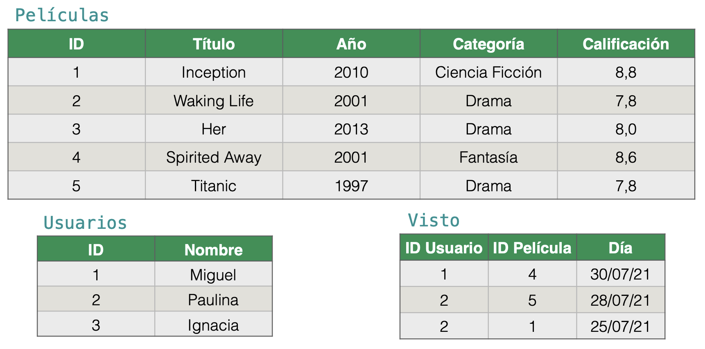

## Introducción

### ¿Por qué este curso?

Las **bases de datos** son muy comunes en el flujo de un proyecto de Data Science


Uno de los lenguajes más solicitados es SQL en el tercer lugar el año 2025

### Objetivos del curso:

- Profundizar en el área de base de datos, tanto desde un punto de vista práctico como teórico/científico.

### ¿Qué es una base de datos?

En nuestro caso...

Una **base de datos** es una colección de datos (digitales) **organizada** de alguna forma para facilitar su manipulación y consulta **eficiente**

Un **sistema (o motor) de base de datos (DBMS)** es un sistema (de software) general para **manejar** bases de datos

- Representar
- Cargar
- Organizar
- Actualizar
- Consultar datos
- etc...

### ¿Por qué necesitamos bases de datos?

Ejemplo: Tienda de cervezas


Queremos manejar:

- Stock
- Compras
- Varidad por marcas
- etc...

#### Implementación a la medida

Continuando con el ejemplo de la "Tienda de Cervezas"

¿Qué necesitamos?

`cervezas.csv`

```bash
código, nombre, tipo, grado, precio unidad
00321, Miller, Lager, 4.7, 1500
00612, Heineken, Pilsner, 5.0, 1800
00433, Budweiser, American Lager, 5.0, 1600
...
```

`stock.csv`

```bash
código, cantidad
00321, 15
00612, 18
00433, 16
...
```

`compra.csv`

```bash
rut, código producto, cantidad, fecha
11222333-4, 00321, 2, 2023-10-15
12345678-9, 00612, 1, 2023-10-15
98765432-1, 00433, 3, 2023-10-16
...
```

:::info
Tener en consideración, problemas con esta implementación:

- Duplicación de datos
- Inconsistencia
- Dificultad para consultas complejas
- Difícil de mantener
- No hay control de concurrencia
- No hay control de acceso
- No hay respaldo de datos
  :::

:::warning
No es la mejor idea programar todo desde 0
:::

### DBMS (Data Base Management System)

Un usuario se puede encargar sólo de diseñar la estructura de los datos, escribir consultas, actualizar datos,...

(Temas especifico a lo que esté construyendo el usuario)

:::success
Mientras tanto, un **DBMS** se encarga de:

- Responder consultas y modificar datos eficientemente.
- Almacenaje optimizado.
- Soporte para gran cantidad de datos.
- Concurrencia.
- Seguridad.
- ...

**Las cosas generales que se necesitaan en muchas aplicaciones.**
:::

### Modelo de datos

¿Cómo organizamos nuestra colección de datos?

El modelo más establecido es el **modelo relacional** que organiza los datos como **tablas**

:::info
Durante el curso se hablará de otros modelos
:::


_Source: [DB-Engines Ranking](https://db-engines.com/en/ranking)_

## Modelo Relacional

### Historia

- Años 60 (antes del modelo relacional)
  - Varios modelos de datos (network, jerárquicos,...)
  - Difíciles de utilizar, dependientes de al parte física, ...
- Modelo relacional (Edgar F. Codd 1970)
  - Fuerte conexión con lógica de primer orden.
  - Datos se almacenan en **relaciones** (o tablas)
  - Lenguajes de consultas **declarativos** y **procedural**
  - Clara separación entre el nivel físico y el nivel lógico de los datos.
  - Esto fue la base para introducción de SQL en 1974 (Chamberlin y Boyce).

### Conceptos básicos


**Relación**: a cada tabla le llamamos relación

    - En este caso: `Películas`

**Atributo**: a cada columna le llamamos atributo

    - En este caso: `ID`, `Título`, `Año`, `Categoría`, `Calificación`

**Tupla**: a cada fila le llamamos tupla

    - Por ejemplo: [`2`, `Waking Life`, `2001`, `Drama`, `7,8`]

### Esquema

Para describir una relación y sus atributos:

    - `Películas(ID, Título, Año, Categoría, Calificación)`

Un **esquema** es la descripción de nuestras relaciones:

    - `Películas(ID, Título, Año, Categoría, Calificación)`
    - `Usuarios(ID, Nombre)`
    - `Visto(ID Usuario, ID Película, Día)`

### Dominio

Se asume que cada **atributo** tiene un **dominio**:

    - `Películas(ID: int, Título: string, Año: int, Categoría: string, Calificación: float)`
    - `Usuarios(ID: int, Nombre: string)`
    - `Visto(ID Usuario: int, ID Película: int, Día: date)`

### Instancia

Una **instancia** de un **esquema** es un **conjunto de tuplas** para cada una de las relaciones del esquema



### Restricciones de integridad

Una **restricción de integridad** es una restricción formal aplicada a un esquema de manera de restringir las posibles instancias.

:::tip Restricción de integridad
Las restricciones de integridad más comunes son las **llaves primarias** (Primary_key)
:::

### Llaves primarias

Una **llave primaria** para una relación es un conjunto de atributos que **determinan** al resto de los atributos de la relación

:::info LLAVE PRIMARIA
La llave primaria debe ser **minimal**
:::

#### Ejemplo 1


#### Ejemplo 2


### Llaves foráneas

Otro tipo común de restricciones de integridad son las **llaves foráneas**

#### Ejemplo 1


:::warning Restricción de integridad
Una vez que definimos una llave foránea forzamos la siguiente restricción:
**Si un valor aparece en la llave foránea entonces debe estar en la llave primaria que apunta**
:::

#### Ejemplo llave foránea incorrecta:


:::tip CONSEJO
Revisa el glosario de esta clase [Glosario Introducción y Modelo Relacional](./glosary.md#clase-1---introducci%C3%B3n-y-modelo-relacional)
