## Modelo Entidad-Relación (ER)

- Entity Relationship Model (MER)

- Permite modelar los requerimientos de una manera **conceptual**

  - De una forma menos técnica que usar tablas

- Es común generar el esquema de la base de datos a partir de un modelo ER

  - Podemos evitar problemas de diseño y obtener modelos más concisos

- Muy útil como complemento del modelo relacional paara documentar, visualizar y comunicar la estructura de datos

### Componentes

Un modelo ER consiste en un **diagrama** con 3 grandes componentes:

<h3>Entidades</h3>

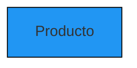

<h3>Atributos de entidades</h3>

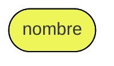

<h3>Relaciones entre entidades</h3>

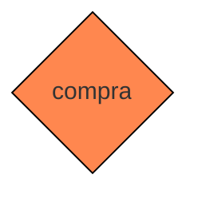

### Entidades y atributos

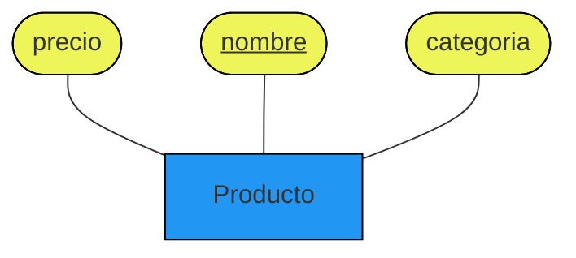

- Cada entidad **debe** tener una **llave**, la cual aparece subrayada en el diagrama
  - Comúnmente es un sólo atributo, pero pueden ser más de uno
  - Misma idea que en el modelo relacional: la llave **determina** la entidad

### Relaciones entre entidades

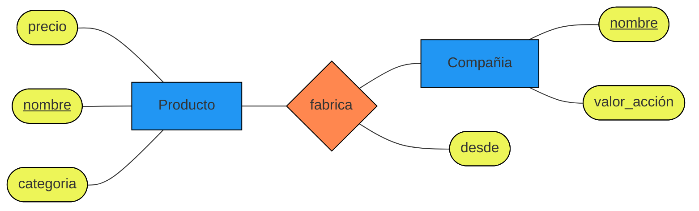

:::tip

- También permitimos atributos en las relaciones como se ve en modelo entidad-relación
- **Las relaciones no tienen llaves**
  :::

### Multiplicidad de relaciones

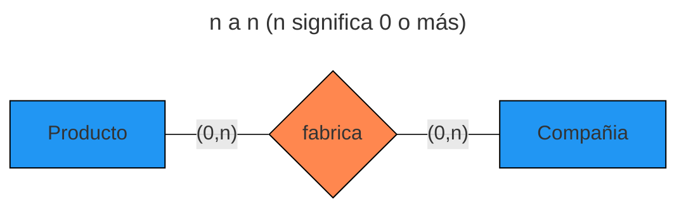

**0 o muchos** Productos pueden fabricar **0 o muchas** Compañias

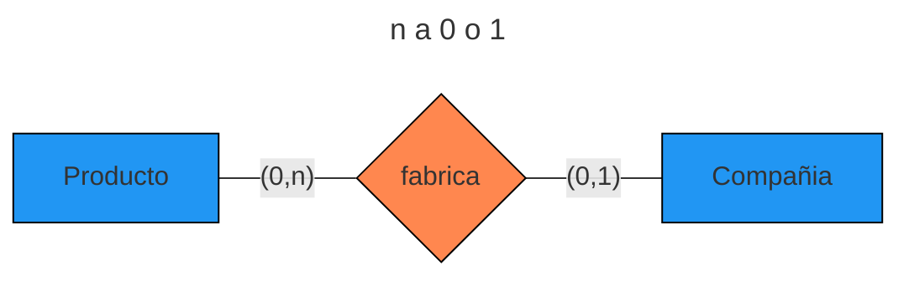

**0 o muchos** Productos pueden fabricar **0 o 1** Compañia


**0 o 1** Producto puede fabricar **0 o muchas** Compañias


**0 o 1** Producto puede fabricar **1 o más** Compañias


**0 o muchos** Productos puede fabricar **solo 1** Compañia

### Ejemplo modelo ER

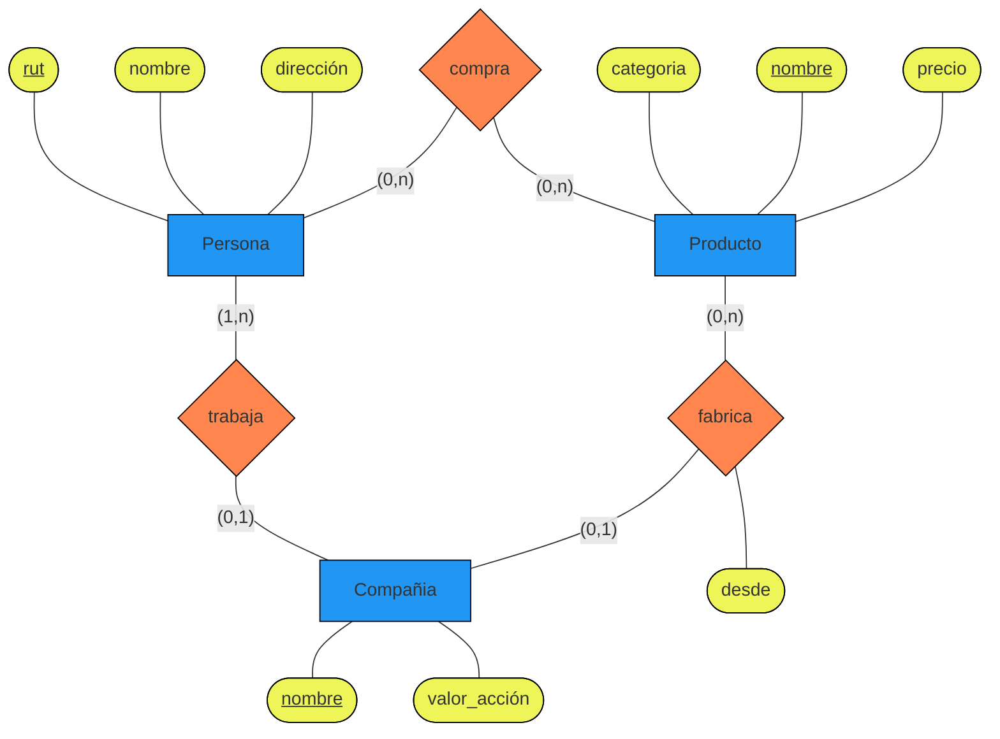

:::tip ¿Multiplicidad de atributos?

Siempre a **1**

- **1** a **1** (e.g., rut)
- **n** a **1** (e.g., categoría)

:::

### Atributos multivaluados

- Atributos que toman más de un valor para una entidad particular

- Se utiliza el doble óvalo **(En este caso se representa con un doble círculo)**

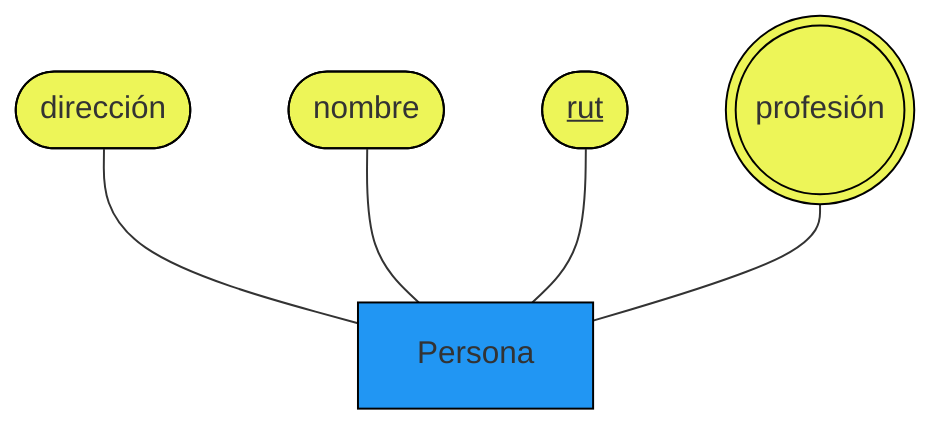

_Una persona podría tener varias profesiones_

### Relaciones múltiples

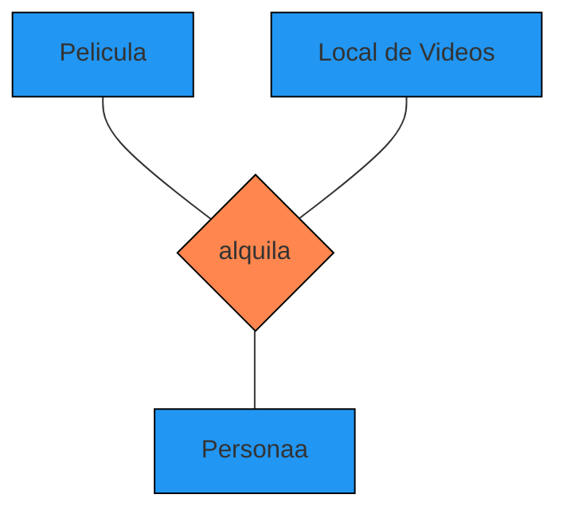

_Es posible relaciones entre 3 o más entidaades (aunque esto es menos común)_

:::tip ¿Multicidades?
Si bien en este caso se utiliza multiplicidades no es tan común

- Tipicamente no hay restricciones

:::

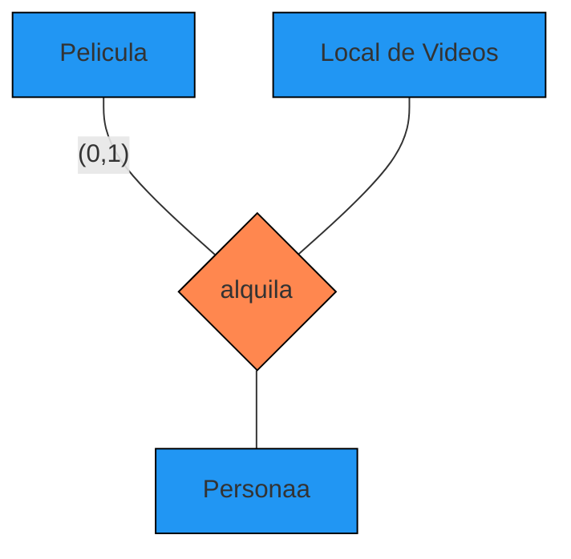

¿Qué significa esto?

- Cada persona que alquila en un local de video puede alquilar a lo más una pelicula

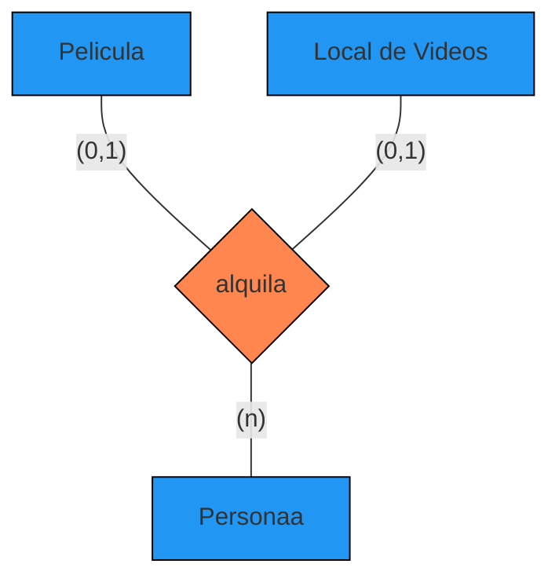

¿Qué significa esto?

- Cada persona que alquila en un solo local de video puede alquilar una pelicula
- O no alquilar nada

:::info Relación múltiples a binárias
Siempre se puede transformar relaciones múltiples a binárias

:::

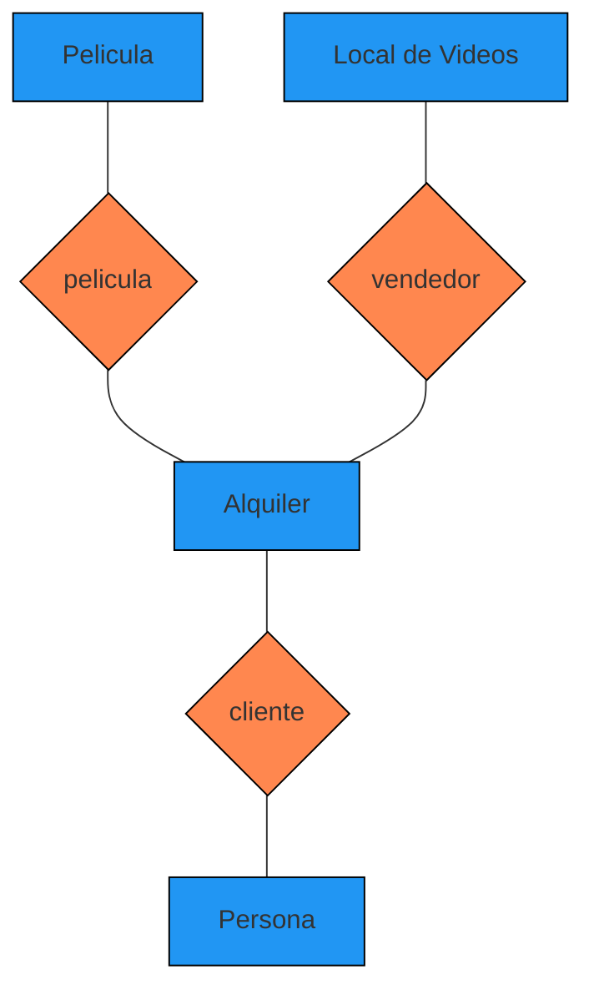

_Más flexible (para agregar más restricciones)_

### Roles

:::info

- A veces una misma entidad participa más de una vez con una **misma** relación
- Es útil por ejemplo en este caso para asignar roles a las distintas apariciones
  :::

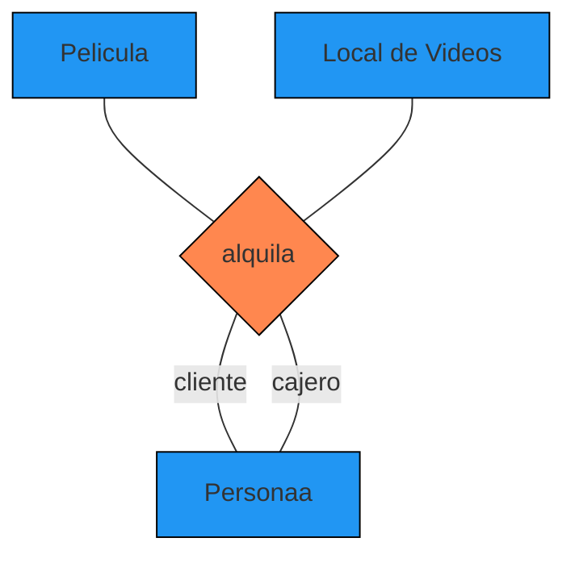

_Ejemplo 1_

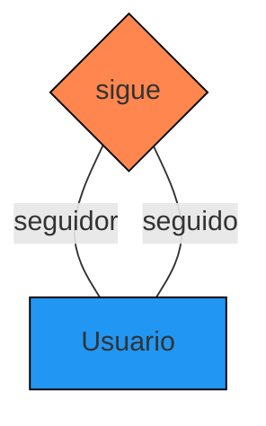

_Ejemplo 2_

### Entidades débiles

- Una entidad débil es la depende de una entidad padre.

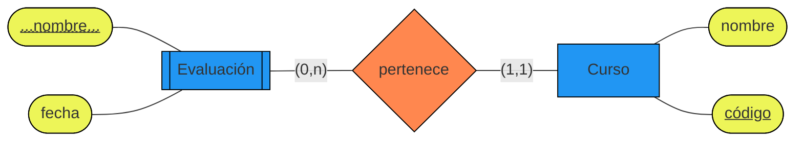

:::tip

- La relación entre la entidad débil y su entidad padre siempre es a 1.
- Una entidad débil tiene una llave **parcial** (Se anota con un subrayado punteado)
- Una entidad débil queda determinada por su llave parcial y su llave entidad padre

:::

### Jerarquía entre entidades

- Podemos tener jerarquía entre entidades IsA (IsA = "Es una/un")
- Los atributos se heredan

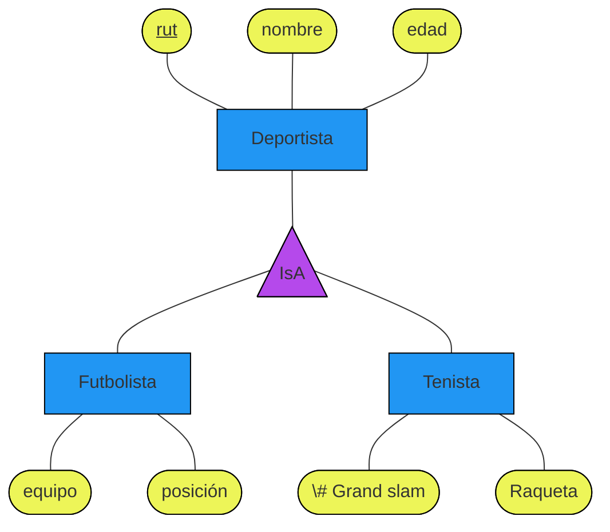

### Del modelo ER al modelo relacional

```mermaid
flowchart LR
    classDef entidad fill:#2196f3,stroke:#000
    classDef atributo fill:#edf558,stroke:#000
    classDef relacion fill:#ff874f,stroke:#000
    Producto[Producto]:::entidad
    Compania[Compañia]:::entidad

    precio([precio]):::atributo
    nombre1([<ins>nombre</ins>]):::atributo
    categoria([categoria]):::atributo
    desde([desde]):::atributo
    nombre2([<ins>nombre</ins>]):::atributo
    valorAccion([valor_acción]):::atributo

    fabrica{fabrica}:::relacion

    precio --- Producto
    nombre1 --- Producto
    categoria --- Producto

    Producto -- "(0,n)" --- fabrica

    fabrica -- "(0,n)" --- Compania

    Compania --- nombre2
    Compania --- valorAccion

    fabrica --- desde
```

1. Las entidades (no débiles) se pasan directamente a tablas:

Conservando sus atributos y llaves

:::success Entidades (no débiles)

- Producto(<ins>nombre</ins>, categoria, precio)
- Compañia(<ins>nombre</ins>, valor_accion)

:::

2. Las relaciones se pasan a tablas:

- Conservamos sus atributos
- La llave es la **únion** de las llaves de las entidades relacionadas (estas últimas por separado pasan a ser foreign_keys)

:::success Relaciones

- Fabrica(<ins>nombre_producto</ins>, <ins>nombre_compañia</ins>, desde)

:::

### Simplificaciones según restricciones

```mermaid
flowchart LR
    classDef entidad fill:#2196f3,stroke:#000
    classDef atributo fill:#edf558,stroke:#000
    classDef relacion fill:#ff874f,stroke:#000
    Producto[Producto]:::entidad
    Compania[Compañia]:::entidad

    precio([precio]):::atributo
    nombre1([<ins>nombre</ins>]):::atributo
    categoria([categoria]):::atributo
    desde([desde]):::atributo
    nombre2([<ins>nombre</ins>]):::atributo
    valorAccion([valor_acción]):::atributo

    fabrica{fabrica}:::relacion

    precio --- Producto
    nombre1 --- Producto
    categoria --- Producto

    Producto -- "(0,n)" --- fabrica

    fabrica -- "(0,1)" --- Compania

    Compania --- nombre2
    Compania --- valorAccion

    fabrica --- desde
```

:::warning En el modelo ER anterior la relación Producto fabrica Compañia era **0 o muchos Productos pueden ser fabricados por 0 o muchas Compañias**

- Por lo cual era correcto:
  - Producto(<ins>nombre</ins>, categoria, precio)
  - Compañia(<ins>nombre</ins>, valor_accion)
  - Fabrica(<ins>nombre_producto</ins>, <ins>nombre_compañia</ins>, desde)

:::

Actualmente se cambió una restricción del modelo ER (0,1)

:::success El Producto determina la compañia

- Producto(<ins>nombre</ins>, categoria, precio)
- Compañia(<ins>nombre</ins>, valor_accion)
- Fabrica(<ins>nombre_producto</ins>, **nombre_compañia**, desde)

:::

Ahora si es que compañia es (1,1)

```mermaid
flowchart LR
    classDef entidad fill:#2196f3,stroke:#000
    classDef atributo fill:#edf558,stroke:#000
    classDef relacion fill:#ff874f,stroke:#000
    Producto[Producto]:::entidad
    Compania[Compañia]:::entidad

    precio([precio]):::atributo
    nombre1([<ins>nombre</ins>]):::atributo
    categoria([categoria]):::atributo
    desde([desde]):::atributo
    nombre2([<ins>nombre</ins>]):::atributo
    valorAccion([valor_acción]):::atributo

    fabrica{fabrica}:::relacion

    precio --- Producto
    nombre1 --- Producto
    categoria --- Producto

    Producto -- "(0,n)" --- fabrica

    fabrica -- "(1,1)" --- Compania

    Compania --- nombre2
    Compania --- valorAccion

    fabrica --- desde
```

:::info Simplificación

- La tabla de la relación se podría simplificar en estos dos casos:
  - Si tenemos alguna multiplicidad 0 o 1 podemos simplificar la llave.
  - Si tenemos alguna multiplicidad 1 podemos eliminar la tabla!

:::

:::success En este ejemplo quedaría

- Producto(<ins>nombre</ins>, precio, categoria, nombre_compania, valor_accion, desde)
- Compañia(<ins>nombre</ins>, valor_accion)

:::

### Atributos multivaluados de modelo ER a modelo relacional

```mermaid
flowchart TB
    classDef entidad fill:#2196f3,stroke:#000
    classDef atributo fill:#edf558,stroke:#000
    classDef relacion fill:#ff874f,stroke:#000

    Persona[Persona]:::entidad
    direccion([dirección]):::atributo
    nombre3([nombre]):::atributo
    rut([<ins>rut</ins>]):::atributo
    profesion(((profesión))):::atributo

    direccion --- Persona
    nombre3 --- Persona
    rut --- Persona
    profesion --- Persona
```

:::info 1era opción

- Persona(<ins>rut</ins>, nombre, direccion, profesion1, profesion2, profesion3)
  - **Esto podría generar muchos valores indefinidos(nulos)**

:::

:::info 2da opción

- Persona(<ins>rut</ins>, nombre, direccion)
- Profesiones(<ins>rut_persona</ins>, <ins>profesion</ins>)

:::

### ¿Caso de roles?

```mermaid
flowchart TB
    classDef entidad fill:#2196f3,stroke:#000
    classDef atributo fill:#edf558,stroke:#000
    classDef relacion fill:#ff874f,stroke:#000

    Usuario[Usuario]:::entidad

    sigue{sigue}:::relacion

    desde([desde]):::atributo
    rut([<ins>rut</ins>]):::atributo
    nombre([nombre]):::atributo

    desde --- sigue
    sigue -- "seguidor" --- Usuario
    sigue -- "seguido" --- Usuario

    Usuario --- rut
    Usuario --- nombre
```

:::success ¿Cómo sería?

- Usuario(<ins>rut</ins>, nombre)
- Sigue(<ins>rut_seguidor</ins>, <ins>rut_seguido</ins>, desde)

:::

### ¿Caso de entidades débiles?

```mermaid
flowchart LR
    classDef entidad fill:#2196f3,stroke:#000
    classDef atributo fill:#edf558,stroke:#000
    classDef atributoDebil text-decoration-style:dotted,text-decoration-line:underline
    classDef relacion fill:#ff874f,stroke:#000

    Evaluacion[[Evaluación]]:::entidad
    Curso[Curso]:::entidad

    pertenece{pertenece}:::relacion

    nombre([...nombre...]):::atributoDebil
    fecha([fecha]):::atributo

    codigo([<ins>código</ins>]):::atributo
    nombre2([nombre]):::atributo

    nombre:::atributo --- Evaluacion
    fecha --- Evaluacion
    Evaluacion -- "(0,n)" --- pertenece
    pertenece -- "(1,1)" --- Curso
    Curso --- nombre2
    Curso --- codigo
```

:::info Tener en consideración

- Se elimina la relación hacia la entidad padre (ya que siempre es a 1)
- La llave de la tabla asociada a la entidad débil es su llave parcial **junto** a la llave del padre.

:::

:::success ¿Cómo se hace?

- Curso(<ins>codigo</ins>, nombre)
- Evaluacion(<ins>nombre</ins>, <ins>codigo_curso</ins>, fecha)

:::

### ¿Caso de jerarquías?

```mermaid
flowchart TB
    classDef entidad fill:#2196f3,stroke:#000
    classDef atributo fill:#edf558,stroke:#000
    classDef relacion fill:#ff874f,stroke:#000
    classDef IsA fill:#b549eb,stroke:#000

    A@{ shape: tri, label: "IsA" }
    A:::IsA

    Deportista[Deportista]:::entidad
    Futbolista[Futbolista]:::entidad
    Tenista[Tenista]:::entidad

    rut([<ins>rut</ins>]):::atributo
    nombre([nombre]):::atributo
    edad([edad]):::atributo

    equipo([equipo]):::atributo
    posicion([posición]):::atributo

    grandSlam([\# Grand slam]):::atributo
    raqueta([Raqueta]):::atributo

    rut --- Deportista
    nombre --- Deportista
    edad --- Deportista
    Deportista --- A
    A --- Futbolista
    A --- Tenista
    Tenista --- grandSlam
    Tenista --- raqueta
    Futbolista --- equipo
    Futbolista --- posicion
```

:::success 1era opción

- Deportista(<ins>rut</ins>, nombre, edad)
- Futbolista(<ins>rut</ins>, equipo, posicion)
- Tenista(<ins>rut</ins>, grand_slam, raqueta)

:::

:::success 2da opción

- Futbolista(<ins>rut</ins>, nombre, edad, equipo, posicion)
- Tenista(<ins>rut</ins>, nombre, edad, grand_slam, raqueta)

:::

#### ¿Cuándo conviene 1era opción?

- Si hay deportistas que no son ni futbolistas ni tenistas
- Si vamos a hacer muchas consultas sobre deportistas en general
- Si hay mucho solapamiento entre las subclases (en este caso no hay solapamiento)

#### ¿Cuándo conviene 2da opción?

- Poco o no hay solapamiento

:::warning En general
Aplicar la solución "razonable" dependiendo del caso particular

:::

:::tip CONSEJO
Revisa el glosario de esta clase [Glosario Modelo Entidad-Relación](./glosary#clase-2---modelo-entidad-relación)
