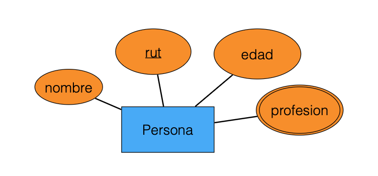

## Parte 1 (30%)

En clases vimos las componentes básicas del modelo Entidad-Relación. Una componente que no vimos es la de atributos multivaluados. Estos son atributos para entidades (o relación) que pueden tomar multiples valores para cada entidad (o relación). Estos atributos se escriben con doble línea. por ejemplo, podemos tener la siguiente entidad:

&nbsp;&nbsp;&nbsp;&nbsp;El atributo _profesión_ es multivaluado bajo el supuesto que una misma persona puede tener varias profesiones.

1. (1.0 pts) **Entregue un ejemplo de un atributo multivaluado para una relación binaria entre dos entidades.** (No puede estar relacionada con el esquema relacional de abajo)

2. Explique cómo haría la transformación de:

   - (a) (1.0 pts) **Una entidad (fuerte) con un atributo multivaluado al modelo relacional.**
   - (b) (1.0 pts) **Una relación binaria mucho a mucho con un atributo multivaluado al modelo relacional.**

3. (3.0 pts) Considere el siguiente esquema relacional:

titles(<u>id</u>, title, release_year, rating, votes) 
names(<u>id</u>, name, birth_year, death_year) 
categories(<u>title_id</u>, <u>category</u>) 
directed(<u>title_id</u>, <u>name_id</u>) 
acted(<u>title_id</u>, <u>name_id</u>, <u>role</u>)

Los títulos representan películas mientras que los nombres representan actores y/o directores. Notar que un título no determina la categoría, es decir, puede pertenecer a varias caategorías. Similarmente, el hecho de que un nombre actúe en cierta película no determina el rol (pueden haber varios roles para la misma película y mismo nombre). **Proponga un digrama Entidad-Relación que capture los datos.** La transformación del diagrama al modelo relacional debe generar el esquema de arriba.

## Parte 2 (30%)

Considere el siguiente esquema relacional que caaptura alumnos, cursos, y la toma de cursos:

alumnos(<u>rut</u>, nombre, edad) 
cursos(<u>codigo</u>, nombre, carrera) 
toma(<u>rut_alumno</u>, <u>codigo_curso</u>)

1. (1.5 pts) **Escriba una consulta en el álgebra relacional que entregue el nombre y edad de todos los alumnos que han tomado el curso llamado "Topología".**

2. (3.0 pts) **Escriba una consulta en el álgebra relacional que entregue el nombre de todos los alumnos que han tomado todos los cursos de la carrera "Informática".**

3. Indique si las siguientes aserciones son verdaderas o falsas. Justifique sus razones:

   - (a) (0.5 pts) **Una expresión de la forma σC(σC(E)) es equivalente a σC ∧ C(E).**
   - (b) (0.5 pts) **Una expresión de la forma πA(πA(E)) es equivalente a πA(E).**
   - (c) (1.0 pts) **El resultado de una expresión σC1(E1 × E2), donde las condiciones no comparten atributos con E1 ni con E2, es equivalente a σC1(E1) × σC2(E2).**

## Parte 3 (40%)

En esta parte deberá trabajar con el motor relacional Postgres y probar algunas consultas.  
Primero deberá crear una instancia en la nube de un servicio de base de datos. Para la ocasión, usaremos el servicio ElephantSQL (https://www.elephantsql.com/).  
Pueden crear la cuenta con su cuenta Gmail y, luego, crear una nueva instancia (el plan gratis "Tiny Turtle" es suficiente).  
Siga los pasos con cuidado y mantenga la información de la instancia (usuario, host, password, etc.).  
Recuerde anotar los datos de conexión (host, database y password). Para conectarse, pueden usar el servicio pgAdmin (https://www.pgadmin.org/) o el cliente de línea de comando.

Trabajaremos con una base de datos de prueba que puede obtener de la Parte 1, ítem 3, es decir:

titles(<u>id</u>, title, release_year, rating, votes) 
names(<u>id</u>, name, birth_year, death_year) 
categories(<u>title_id</u>, <u>category</u>) 
directed(<u>title_id</u>, <u>name_id</u>) 
acted(<u>title_id</u>, <u>name_id</u>, <u>role</u>)

Esta base de datos corresponde a una parte de los datos del Internet Movie Database (IMDb) (https://www.imdb.com/interfaces/).  
Se filtraron los datos originales para quedarnos con películas con al menos 100.000 votos, a fin de no exceder la cuota.  
Para cargar esta base de datos se provee un archivo **dump_imdb.sql** con los comandos para su creación.
