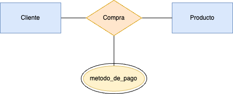
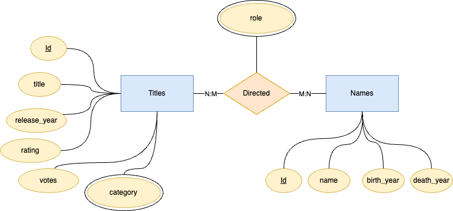

## Parte 1 (30%)

En clases vimos las componentes básicas del modelo Entidad-Relación. Una componente que no vimos es la de atributos multivaluados. Estos son atributos para entidades (o relación) que pueden tomar multiples valores para cada entidad (o relación). Estos atributos se escriben con doble línea. por ejemplo, podemos tener la siguiente entidad:

&nbsp;&nbsp;&nbsp;&nbsp;El atributo _profesión_ es multivaluado bajo el supuesto que una misma persona puede tener varias profesiones.

1. (1.0 pts) **Entregue un ejemplo de un atributo multivaluado para una relación binaria entre dos entidades.** (No puede estar relacionada con el esquema relacional de abajo)

2. Explique cómo haría la transformación de:

   - (a) (1.0 pts) **Una entidad (fuerte) con un atributo multivaluado al modelo relacional.**
   - (b) (1.0 pts) **Una relación binaria mucho a mucho con un atributo multivaluado al modelo relacional.**

3. (3.0 pts) Considere el siguiente esquema relacional:

titles(<u>id</u>, title, release_year, rating, votes) 
names(<u>id</u>, name, birth_year, death_year) 
categories(<u>title_id</u>, <u>category</u>) 
directed(<u>title_id</u>, <u>name_id</u>) 
acted(<u>title_id</u>, <u>name_id</u>, <u>role</u>)

Los títulos representan películas mientras que los nombres representan actores y/o directores. Notar que un título no determina la categoría, es decir, puede pertenecer a varias caategorías. Similarmente, el hecho de que un nombre actúe en cierta película no determina el rol (pueden haber varios roles para la misma película y mismo nombre). **Proponga un digrama Entidad-Relación que capture los datos.** La transformación del diagrama al modelo relacional debe generar el esquema de arriba.

## Solución

### Pregunta 1

#### Ejemplo de un atributo multivaluado para una relación binaria entre dos entidades.

Supongamos que tenemos dos entidades: **Cliente** y **Producto**, unidas por la relación binaria **_Compra_**. Podríamos incorporar un atributo multivaluado en esta relación, por ejemplo, **métodos_de_pago**, que capture todos los tipos de pago que el cliente usa para adquirir ese producto (`efectivo`, `tarjeta de débito`, `tarjeta de crédito`, etc...). Como un mismo cliente podría utilizar múltiples métodos de pago en una compra específica, este atributo se modelaría como multivaluado en la relación que se muestra en la imágen superior.

### Pregunta 2

#### (a) Entidad (fuerte) con un atributo multivaluado

Para transformar una entidad fuerte que tiene un atributo multivaluado al modelo relacional, se sigue el siguiente procedimiento:

- **Paso 1:** Crear una relación para la entidad con todos sus atributos simples (no multivaluados). La clave primaria de esta tabla identifica de forma única a cada entidad.
- **Paso 2:** Crear una relación adicional para el atributo multivaluado. Esta tabla tendrá:
  - Una columna que actúe como clave foránea referenciando la clave primaria de la tabla de la entidad.
  - Una columna para almacenar cada uno de los valores del atributo multivaluado.
- **Clave primaria compuesta:** En esta nueva tabla, se establece una clave primaria compuesta por la clave foránea (identificador de la entidad) y el valor del atributo multivaluado, lo que garantiza que cada combinación sea única.

**Ejemplo:**  
Si tenemos la entidad **Empleado** con clave primaria `id` y un atributo multivaluado `telefonos`, se crean las siguientes tablas:

1. **Empleado(id, nombre, dirección, ...)**
2. **Empleado_telefonos(empleado_id, telefono)**
   - Aquí, `empleado_id` es foráneo de `Empleado(id)` y la clave primaria de `Empleado_telefonos` es la combinación (`empleado_id`, `telefono`).

---

#### (b) Relación binaria muchos a muchos con un atributo multivaluado

Para transformar una relación muchos a muchos que además posee un atributo multivaluado, se debe proceder de forma similar pero considerando que la relación ya se representa en el modelo relacional mediante una tabla intermedia.

- **Paso 1:** Crear la relación intermedia para la relación muchos a muchos, la cual contendrá:
  - Las claves foráneas que referencian las entidades involucradas.
  - Otras columnas que formen parte de la relación (si las hay) pero que no son multivaluadas.
  - La clave primaria suele ser la combinación de ambas claves foráneas.
- **Paso 2:** Dado que el atributo es multivaluado, no se pueden almacenar múltiples valores en una sola celda de la relación intermedia. Por ello, se crea una tabla adicional para el atributo multivaluado.
  - Esta nueva tabla incluirá las claves foráneas de la tabla intermedia (o, en su defecto, la clave primaria compuesta de la tabla de la relación) y la columna para el valor del atributo multivaluado.
- **Clave primaria compuesta:** La tabla adicional tendrá como clave primaria la combinación de las claves foráneas de la relación y el valor del atributo multivaluado.

**Ejemplo:**  
Si tenemos las entidades **Estudiante** y **Curso**, relacionadas mediante una relación muchos a muchos **Inscripción**. Si además, la relación **Inscripción** tiene un atributo multivaluado `motivos` (razones por las que el estudiante eligió ese curso), se procedería así:

1. **Inscripción(estudiante_id, curso_id, fecha_inscripción, ...)**
   - La clave primaria es (`estudiante_id`, `curso_id`).
2. **Inscripción_motivos(estudiante_id, curso_id, motivo)**
   - Aquí, `estudiante_id` y `curso_id` son foráneos que hacen referencia a la tabla **Inscripción** y la clave primaria de **Inscripción_motivos** es la combinación (`estudiante_id`, `curso_id`, `motivo`).

Así se modela adecuadamente el atributo multivaluado en una relación muchos a muchos en el modelo relacional.

### Pregunta 3

Breve descripción de MER propuesto

- **Entidades:**

  - **Titles:** con atributos `id` (clave primaria), `title`, `release_year`, `rating` y `votes`.
  - **Names:** con atributos `id` (clave primaria), `name`, `birth_year` y `death_year`.

- **Atributo Multivaluado:**

  - **Category:** asociado a **Titles**, representado indica que un título puede tener varias categorías.
  - **role:** asociado a **Directed**, representado indica que la relación acted.

- **Relaciones:**

  - **Directed:** relación M:N entre **Titles** y **Names**.
