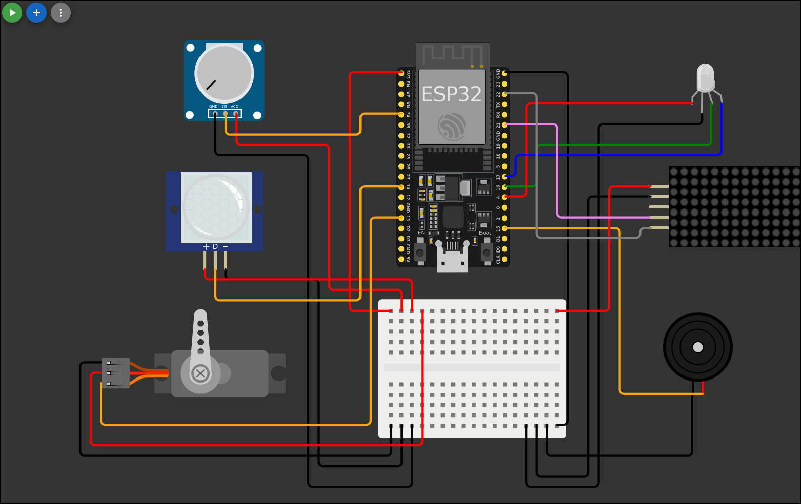

# Manual de Uso Básico - Sistema de Monitoreo IoT Casa Inteligente

## 🏠 Introducción

Bienvenido al sistema de monitoreo IoT para casa inteligente. Esta aplicación permite controlar remotamente la iluminación, gestionar el consumo energético y monitorear la actividad en tu hogar mediante un dashboard web intuitivo.

## Diagrama de Conexiones

## 🎛️ Controles Principales

### 💡 Control de Iluminación RGB

#### Encender/Apagar LED

- **Switch LED ON/OFF**: Clic para encender o apagar la iluminación
- **Respuesta**: Inmediata al presionar

#### Cambiar Color

- **Selector de Color**: Toca el círculo para abrir paleta de colores
- **Colores disponibles**: Toda la gama RGB (16.7 millones de colores)
- **Aplicación**: El color cambia instantáneamente al seleccionar

### 🔄 Modos del Sistema

El sistema tiene 4 modos de operación que controlan el comportamiento del sueño y sonidos:

#### ☕ Modo Cafeína (Botón 0)

- **Función**: Sistema siempre activo, nunca entra en reposo
- **Uso**: Para sesiones de trabajo largas o vigilancia continua
- **Indicador**: Icono de taza de café en matriz LED
- **Sonidos**: No hay melodías

#### 🌙 Modo Sleepy (Botón 1) - **MODO NORMAL**

- **Función**: Comportamiento estándar con reposo automático
- **Uso**: Operación normal diaria
- **Indicador**: Icono de luna con ZZZ en matriz LED
- **Sonidos**: No hay melodías

#### 🔇 Modo Mudo (Botón 2)

- **Función**: Operación silenciosa, sin sonidos
- **Uso**: Para ambientes que requieren silencio (oficinas, bibliotecas)
- **Indicador**: Icono de altavoz tachado en matriz LED
- **Sonidos**: Completamente silencioso

#### 🎵 Modo Cantor (Botón 3)

- **Función**: Con efectos sonoros al dormir y despertar
- **Uso**: Para ambientes donde los sonidos son bienvenidos
- **Indicador**: Icono de nota musical en matriz LED
- **Sonidos**: Melodías de Mario Bros

### ⏰ Configuración de Tiempo de Reposo

#### Control Remoto (Dashboard)

- **Slider "Tiempo Sleep"**: Desliza entre 5 y 20 segundos
- **Aplicación**: El cambio se aplica inmediatamente
- **Indicador**: Valor actual se muestra en el slider

#### Control Local (Potenciómetro)

- **Ubicación**: Potenciómetro físico en el dispositivo
- **Rango**: Gira completamente para ajustar de 5 a 20 segundos
- **Prioridad**: Control local anula configuración remota temporalmente

## 🔍 Indicadores del Sistema

### 📟 Matriz LED 8x8

La matriz muestra iconos que indican el modo actual:

- **☕ Taza**: Modo Cafeína
- **🌙 Luna**: Modo Sleepy
- **🔇 Altavoz**: Modo Mudo
- **🎵 Nota**: Modo Cantor

### 🔄 Servomotor (Indicador de Cuenta Regresiva)

- **180° (Vertical)**: Sistema completamente activo
- **Movimiento gradual**: Indica tiempo restante antes del reposo
- **0° (Horizontal)**: Sistema en reposo o a punto de entrar

### 📢 Indicadores de Estado

El área **"Estado Sistema"** muestra mensajes en tiempo real:

- `"Sistema iniciado correctamente"`
- `"Movimiento detectado!"`
- `"Modo cambiado a: [Nombre del modo]"`
- `"Tiempo de sleep cambiado a: [X]s"`
- `"Entrando en modo deep sleep..."`
- `"Sistema despertado por movimiento"`

## 🚶 Funcionamiento Automático

### Detección de Movimiento

1. **Sensor PIR** detecta presencia humana automáticamente
2. **Alcance**: 3-5 metros en ángulo de 120°
3. **Respuesta**: Sistema se activa inmediatamente
4. **Reinicio**: Cuenta regresiva se reinicia con cada movimiento

### Ciclo de Reposo Inteligente

1. **Sin movimiento detectado** → Inicia cuenta regresiva
2. **Servomotor se mueve gradualmente** hacia posición de reposo
3. **Al completar el tiempo** → Sistema entra en modo de bajo consumo
4. **Detección de movimiento** → Sistema despierta instantáneamente

### Efectos Sonoros (Solo Modo Cantor)

- **Al dormir**: Melodía descendente suave (4 notas)
- **Al despertar**: Melodía energética tipo "power-up" (6 notas)
- **Inspiración**: Efectos clásicos de Super Mario Bros

## ⚡ Consejos de Ahorro Energético

### Configuraciones Eficientes

- **Usar Modo Sleepy**: Permite reposo automático (ahorro del 99.9%)
- **Tiempo corto**: 5-10 segundos para espacios con poco tráfico
- **Tiempo largo**: 15-20 segundos para espacios de trabajo

### Indicadores de Eficiencia

- **Servomotor en 0°**: Sistema en reposo, consumo mínimo
- **LED RGB apagado**: Cuando no se necesita iluminación
- **Mensajes de reposo**: Confirman entrada en modo de bajo consumo

---

## 🎯 Inicio Rápido (5 minutos)

1. **Accede** al dashboard en [create.arduino.cc](https://create.arduino.cc)
2. **Enciende** el LED con el switch
3. **Selecciona** un color que te guste
4. **Configura** Modo Sleepy para uso normal
5. **Ajusta** tiempo de reposo a 5-20 segundos
6. **Muévete** frente al sensor para probar detección
7. **Observa** el servomotor durante la cuenta regresiva
8. **¡Listo!** Tu sistema está funcionando

---
