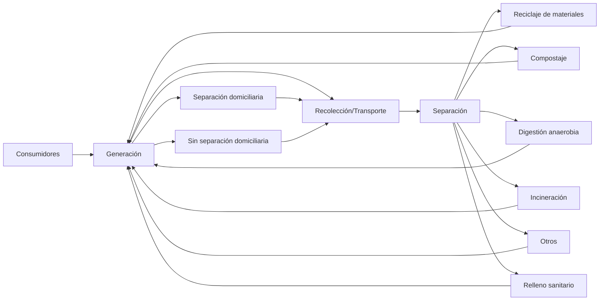

### Contenidos

- Componentes y jerarquía de alternativas de un sistema de manejo de residuos sólidos.
- Caracterización de residuos sólidos.
- Procesos convencionales de tratamiento de residuos sólidos.
  - Disposición final: Rellenos sanitarios.
  - Tratamientos térmicos.
- Procesos de valorización de residuos sólidos.
  - Compostaje.
  - Lombricultura.
  - Digestión anaerobia.

### Componentes y jerarquía de alternativas de un sistema de manejo de residuos sólidos

#### Generalidades

- ¿Qué son los residuos sólidos?

Los residuos son sustancias u objetos que habiendo llegado al final de su vida útil se desechan, procediendo a tratarlos mediante valorización o eliminación. (Que no tiene utlidad)

#### Problemas asociados a los residuos sólidos

Ambiental

- Contaminación atmosférica
- Contaminación del agua
- Contaminación del suelo

Salud pública

- Propagación de enfermedades
- Riesgo de accidentes

Social

- Impacto paisajístico
- Mal olor

#### Origen de los residuos sólidos

| Fuentes                   | Locales                                                                                                                         | Tipo de residuos                                                                                   |
| ------------------------- | ------------------------------------------------------------------------------------------------------------------------------- | -------------------------------------------------------------------------------------------------- |
| Doméstica                 | Viviendas unifamiliares y multifamiliares, apartamentos de media o gran altura                                                  | Alimentos, papel, embalaje, vidrio, metal, cenizas de basura doméstica, basura doméstica peligrosa |
| Comercial                 | Tiendas, restaurantes, mercados, oficinas y hoteles                                                                             | Alimentos, papel, embalaje, vidrio, metal, cenizas de basura doméstica, basura doméstica peligrosa |
| Industrial                | Fabricación, industrias productoras de materiales ligeros y pesados, refinerías, plantas químicas, minas, generación de energía | Residuos de procesos industriales, metales, maderas, plásticos, aceites y residuos peligrosos      |
| Construcción y demolición |                                                                                                                                 | Tierra, cemento, madera, acero, plástico, vidrio, vegetación                                       |

#### Historia del manejo de residuos sólidos

**Primera estapa: "Dispersar y diluir"**

Deshacerse de los residuos confiando que la naturaleza se hará cargo.

- Esto funcionaba cuando eran pocos residuos

**Recuperación de resursos (Finales del siglo XX)**

Reducir la taasa de extracción de recursos naturales

**Hoy: Diseño limpio**

- Diseñar productos y procesos para la sostenibilidad

  - Utilizar materiales que pueden reincorporarse al ciclo.
  - Eliminar el uso de químicos tóxicos o sus precursores.
  - Emular la naturaleza en vez de contaminarla.

- Conceptos guía: Cradle to Cradle, Permacultura, Biomética.

### Generación de residuos sólidos

:::info Actualmente per cápita
Generamos 1Kg por día
:::

#### Composición de los residuos municipales en Chile (2009)

| Tipo de residuo    | Composición (%) |
| ------------------ | --------------- |
| Papeles y Cartones | 12.4            |
| Textiles           | 2.0             |
| Plásticos          | 9.4             |
| Vidrios            | 6.6             |
| Metales            | 2.3             |
| Materia Orgánica   | 53.3            |
| Otros              | 14.0            |

### Manejo de residuos sólidos: Clasificación

#### Clasificación según su biodegradabilidad

1. **Biodegradables**

   - Residuos que pueden descomponerse naturalmente
   - Ejemplos: restos de comida, papel, cartón

2. **No biodegradables**
   - Combustibles
     - Papel
     - Plástico
     - Textiles
   - No combustibles
     - Vidrio
     - Metal
     - Mampuestos

**Según tipo de manejo**

Residuo peligroso: Presenta riesgo para la salud de los humanos o de otros organismos, o para el medio ambiente.

Residuo no peligroso: No presenta ninguna de las caaracterísticas de peligrosidad pero no pueden considerarse inertes.

Residuos inertes: Aquel residuo no peligroso que no experimenta transformaciones físicas, químicas o bilógicas significativas.

### Infraestructura para su manejo

Objetivo principal:

- Asegurar la salud y proteger el medio ambiente.

Otros objetivos comunes:

- Mejorar la calidad del medio ambiente urbano.
- Mantener una economía productiva y eficiente.
- Generar empleo e ingresos.

### Separación

Materiales cuyo reciclaje sea rentable
