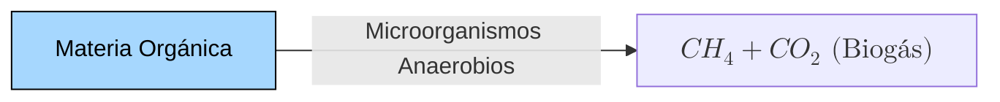

### Beneficios de la digestión anaerobia

No se eliminan los nutrientes (N, P)

### Estimación del biogás estimado

Estimación teórica de la cantidad ("Estequiometría)

Ecuación de Busswell

$$C_aH_bO_cN_d + (a-\frac{b}{4}-\frac{c}{2}+\frac{3d}{4})H_2O \rightarrow (\frac{a}{2}+\frac{b}{8}-\frac{c}{4}-\frac{3d}{8})CH_4 + (\frac{a}{2}-\frac{b}{8}+\frac{c}{4}+\frac{3d}{8})CO_2 + dNH_3$$

### ¿Qué ventajas tiene el tratamiento de residuos sólidos mediante el proceso de digestión anaerobia?

### Ejercicios

#### Pregunta 1

Un residuo municipal que contiene un 60% de fracción orgánica cuya composición genérica es $C_{55}H_{85}O_{34}N$ se va a tratar mediante digestión anaerobia. Para ello se requiere añadir purín de cerdo para ajustar la relación C/N a un valor de 20. Determinar cuántos litros de purín se tendrán que añadir por kg de residuo.

Datos del purín:

- 12 g COT/L
- 4 g $NH_4^+$/L

Desarrollo:
fa = 60%
$C_{55}H_{85}O_{34}N$
C/N=20

Fracción orgánica

gFA = gramos formación orgánica

$\frac{gC}{ \text{gFA}} = \frac{12 \cdot 55}{(12 \cdot 55) + (85 \cdot 1) + (16 \cdot 34) + 14} = 0.506 \frac{gC}{ \text{gFA}}$

$\frac{gN}{ \text{gFA}} = \frac{14}{(12 \cdot 55) + (85 \cdot 1) + (16 \cdot 34) + 14} = 0.0107 \frac{gN}{\text{gFA}}$

Residuo

$gC = 0.506 \cdot 0.6 \cdot 1000 = 303.6 \text{ gC}$

$gN = 0.0154 \cdot 0.6 \cdot 1000 = 9.24 \text{ gN}$

Balance $\frac{C}{N} = 20$

$\frac{303.6 + 12x}{9.24 + 4x} = 20$

$303.6 + 12x = 184.8 + 80x$

$303.6 - 184.8 = 80x - 12x$

$118.8 = 68x$

$x = 1.747 \text{ L purín}$

Por tanto, se necesitan 1.747 L de purín por kg de residuo.

#### Pregunta 2

Considerando una composición genérica de $C_{55}H_{85}O_{34}N$ para la fracción orgánica de un residuo sólido municipal, calcular el volumen máximo de metano ($0^{\circ}$C, 1 atm) que se podría generar por kg de residuo y el porcentaje esperado de metano en el biogás.

**Dato: la fracción orgánica constituye el 60\% del peso del residuo.**

**Desarrollo**:

Reacción de digestión anaerobia:
$C_{55}H_{85}O_{34}N + 16H_2O \rightarrow 28CH_4 + 27CO_2 + NH_3$

Calculamos el peso molecular de la fracción orgánica:
PM = $(55 \cdot 12) + (85 \cdot 1) + (34 \cdot 16) + 14 = 1307 \text{ g/mol}$

Por cada mol de fracción orgánica se generan 28 moles de $CH_4$

Para 1 kg de residuo con 60% de fracción orgánica:
$\frac{0.6 \text{ kg} \cdot 1000 \text{ g/kg}}{1307 \text{ g/mol}} = 0.459 \text{ moles de fracción orgánica}$

Moles de $CH_4$ generados:
$0.459 \text{ moles} \cdot 28 = 12.85 \text{ moles } CH_4$

Volumen de $CH_4$ (0°C, 1 atm):
$V = \frac{nRT}{P} = \frac{12.85 \text{ mol} \cdot 0.082 \text{ L}\cdot\text{atm}/\text{mol}\cdot\text{K} \cdot 273.15 \text{ K}}{1 \text{ atm}} = 287.5 \text{ L } CH_4$

Porcentaje de $CH_4$ en el biogás:
$\%CH_4 = \frac{28}{28 + 27} \cdot 100 = 50.9\%$

Por tanto, se generarían 287.5 L de metano por kg de residuo, y el biogás contendría un 50.9% de metano.

#### Pregunta 3

Se realizó un ensayo anaerobio discontinuo con 1 g SV de un residuo con el fin de determinar su potencial de biometanización y la constante de hidrólisis, obtenido los siguientes datos:

| Tiempo (días)      | 1   | 2    | 3    | 5    | 10   | 15   | 20  | 30  |
| ------------------ | --- | ---- | ---- | ---- | ---- | ---- | --- | --- |
| Volumen $CH_4$ (L) | 0.1 | 0.21 | 0.26 | 0.35 | 0.47 | 0.49 | 0.5 | 0.5 |

Determinar el potencial de biometanización del residuo y su constante de hidrólisis.

#### Desarrollo

Para determinar el potencial de biometanización y la constante de hidrólisis, usaremos el modelo cinético de primer orden:

$V = V_{max}(1-e^{-kt})$

Donde:

- V = volumen de metano producido en el tiempo t
- $V_{max}$ = potencial de biometanización
- k = constante de hidrólisis
- t = tiempo

De los datos experimentales observamos que:
$V_{max} = 0.5 \text{ L } CH_4/\text{g SV}$

Para calcular k, tomamos un punto intermedio (t = 5 días):
$0.35 = 0.5(1-e^{-5k})$

$\frac{0.35}{0.5} = 1-e^{-5k}$

$0.7 = 1-e^{-5k}$

$e^{-5k} = 0.3$

$k = \frac{-\ln(0.3)}{5} = 0.24 \text{ días}^{-1}$

Por tanto:

- Potencial de biometanización = 0.5 L $CH_4$/g SV
- Constante de hidrólisis = 0.24 $\text{días}^{-1}$

#### Pregunta 4

Se van a realizar dos ensayos anaerobios discontinuos uno de ellos con 1 g SV de un SV de excrementos vacunos (k_H= 0.05 d^-1 y B_infinito= 0.4 LCH_4/g SV) y el otro con 1 g

#### Pregunta 5

Se ha realizado un ensayo de potencial metanogénico de un residuo orgánico cuya composición es $C_{50}H_{80}O_{25}N$, obteniéndose 0.4 L $CH_4$/g SV. Determinar el porcentaje de SV que se han convertido en metano.

**Desarrollo**:

Aplicando la ecuación de Buswell:

$C_{50}H_{80}O_{25}N + 24H_2O \rightarrow 27CH_4 + 23CO_2 + NH_3$

Peso molecular del residuo:
$PM = (50 \cdot 12) + (80 \cdot 1) + (25 \cdot 16) + 14 = 1094 \text{ g/mol}$

Por cada mol de residuo se generan 27 moles de $CH_4$

Volumen teórico de $CH_4$ (0°C, 1 atm):
$V_{teo} = \frac{27 \text{ mol } CH_4 \cdot 0.082 \text{ L}\cdot\text{atm}/\text{mol}\cdot\text{K} \cdot 273.15 \text{ K}}{1 \text{ atm}} = 604.8 \text{ L } CH_4/\text{mol residuo}$

$V_{teo} = \frac{604.8 \text{ L}}{1094 \text{ g}} = 0.553 \text{ L } CH_4/\text{g residuo}$

Porcentaje de conversión:
$\% \text{ conversión} = \frac{0.4}{0.553} \cdot 100 = 72.3\%$

Por tanto, el 72.3% de los SV se han convertido en metano.
