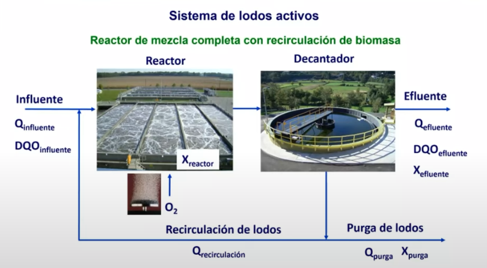
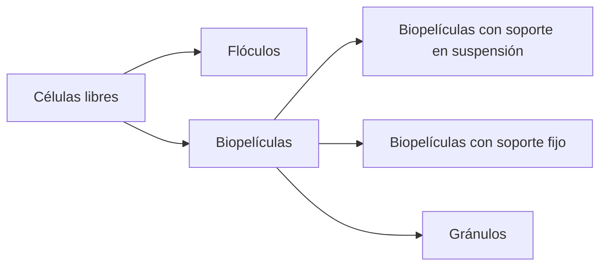
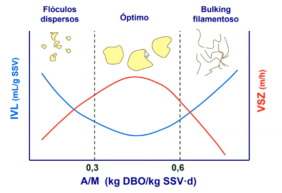
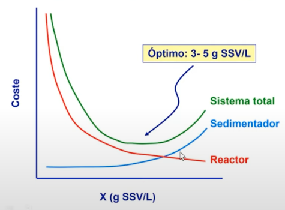

### Sistema de lodos activos

El sistema de lodos activos se puede representar mediante diferentes estructuras que se forman a partir de células libres mediante procesos de agregación:

Los lodos activos pueden presentarse en diferentes formas:

- Flóculos: Agregaciones de células microbianas
- Biopelículas: Pueden estar en suspensión o adheridas a un soporte fijo
- Gránulos: Formaciones esféricas de biomasa

#### Parámetros de operación y diseño

Tiempo de residencia hidráulico (TRH) en días

$$
TRH = \frac{V_{reactor}}{Q_{influente}}
$$

Tiempo de residencia de sólidos/celular (TRS) en días

$$
TRS = \frac{V_{reactor} \cdot X_{reactor}}{Q_{purga} \cdot X_{purga} + Q_{efluente} \cdot X_{efluente}}
$$

Eficacia del tratamiento en %

$$
Eficacia = \frac{DQO_{influente} - DQO_{efluente}}{DQO_{influente}} \cdot 100
$$

Carga orgánica en g DQO/día

$$
CO = DQO_{influente} \cdot Q_{influente}
$$

Velocidad de carga orgánica en g DQO/L\*día

$$
VCO = \frac{Q_{influente} \cdot DQO_{influente}}{V_{reactor}}
$$

Velocidad de carga orgánica específica en g DQO/g SSV\*día

$$
VCO_{esp} = \frac{Q_{influente} \cdot DQO_{influente}}{V_{reactor} \cdot X_{reactor}}
$$

### Ejercicio 1

Tratamiento aerobio:

Un sistema aerobio de $2 m^3$ se alimenta a razón de $4 m^3/d$ con una agua residual que contiene $0.5 g DQO/L$. Si la concentración de biomasa es de $1.5 g SSV/L$ y la DQO de salida es de $80 mg DQO/L$, calcular:

1. Tiempo de residencia hidráulico (TRH)
2. Velocidad de carga orgánica (VCO)
3. Velocidad de carga orgánica específica (VCO_esp)
4. Carga orgánica (CO)
5. Eficacia del tratamiento

Si la concentración de biomasa en el efluente es de $30 mg SSV/L$ y de $5 g SSV/L$ en la corriente de recirculación de lodos al reactor. Calcular el caudal que se debe purgar de dicha corriente para que el tiempo de residencia celular (TRS) sea de $10 días$.

### Velocidad de sedimentación

#### Ley de Stokes:

$$
VSZ = \frac{g \cdot (\rho_{lodo} - \rho_{agua}) \cdot d^2}{18 \cdot \mu}
$$

Donde:

- $g$: Aceleración de la gravedad ($9.81 m/s^2$)
- $\rho_{lodo}$: Densidad del lodo (kg/m³)
- $\rho_{agua}$: Densidad del agua (kg/m³)
- $d$: Diámetro de la partícula (m)
- $\mu$: Viscosidad del agua (Pa·s)

Flóculos:

- Tamaño: 10-150 μm --> Baja VSZ
- Densidad: 1020-1040 kg/m³

#### Índice volumétrico de lodos (IVL)

$$
IVL = \frac{Vol_{30}}{X \cdot V_{total}}
$$

Donde:

- $Vol_{30}$: Volumen lodo 30 minutos (mL)
- $X$: Concentración biomasa (g SST/L)
- $V_{total}$: Volumen de la probeta (L)

Buena sedimentabilidad:
IVL < 150 mL/g SST

#### Dieta Floculos

#### Influencia de la concentración de biomasa

La concentración de biomasa afecta significativamente los costos operativos:

Puntos clave del gráfico:

- El punto óptimo de operación se encuentra entre 3-5 g SSV/L
- El costo total es la suma de los costos del reactor y sedimentador
- A bajas concentraciones, domina el costo del reactor
- A altas concentraciones, aumenta el costo del sedimentador
