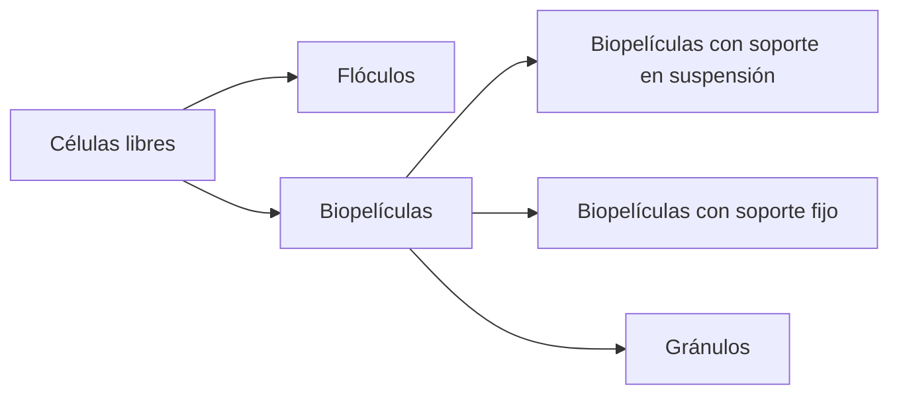

### Sistema de lodos activos

El sistema de lodos activos se puede representar mediante diferentes estructuras que se forman a partir de células libres mediante procesos de agregación:

Los lodos activos pueden presentarse en diferentes formas:

- Flóculos: Agregaciones de células microbianas
- Biopelículas: Pueden estar en suspensión o adheridas a un soporte fijo
- Gránulos: Formaciones esféricas de biomasa

#### Parámetros de operación y diseño

Tiempo de residencia hidráulico (TRH) en días

$$
TRH = \frac{V_{reactor}}{Q_{influente}}
$$

Tiempo de residencia de sólidos/celular (TRS) en días

$$
TRS = \frac{V_{reactor} \cdot X_{reactor}}{Q_{purga} \cdot X_{purga} + Q_{efluente} \cdot X_{efluente}}
$$

Eficacia del tratamiento en %

$$
Eficacia = \frac{DQO_{influente} - DQO_{efluente}}{DQO_{influente}} \cdot 100
$$

Carga orgánica en g DQO/día

$$
CO = DQO_{influente} \cdot Q_{influente}
$$

Velocidad de carga orgánica en g DQO/L\*día

$$
VCO = \frac{Q_{influente} \cdot DQO_{influente}}{V_{reactor}}
$$

Velocidad de carga orgánica específica en g DQO/g SSV\*día

$$
VCO_{esp} = \frac{Q_{influente} \cdot DQO_{influente}}{V_{reactor} \cdot X_{reactor}}
$$

### Ejercicio 1

Tratamiento aerobio:

Un sistema aerobio de $2 m^3$ se alimenta a razón de $4 m^3/d$ con una agua residual que contiene $0.5 g DQO/L$. Si la concentración de biomasa es de $1.5 g SSV/L$ y la DQO de salida es de $80 mg DQO/L$, calcular:

1. Tiempo de residencia hidráulico (TRH)
2. Velocidad de carga orgánica (VCO)
3. Velocidad de carga orgánica específica (VCO_esp)
4. Carga orgánica (CO)
5. Eficacia del tratamiento

Si la concentración de biomasa en el efluente es de $30 mg SSV/L$ y de $5 g SSV/L$ en la corriente de recirculación de lodos al reactor. Calcular el caudal que se debe purgar de dicha corriente para que el tiempo de residencia celular (TRS) sea de $10 días$.

### Solución del ejercicio 1

1. **Tiempo de residencia hidráulico (TRH)**

$$
 TRH = \frac{V_{r}}{Q_{i}} = \frac{2 m^3}{4 m^3/d} = 0.5 \left[d\right]
$$

2. **Velocidad de carga orgánica (VCO)**

$$
 VCO = \frac{Q_{i} \cdot DQO_{i}}{V_{r}} = \frac{4 m^3/d \cdot 0.5 g DQO/L}{2 m^3} = 1 \left[\frac{kg DQO}{m^3 \cdot d}\right]
$$

3.  **Velocidad de carga orgánica específica (VCO_esp)**

$$
 VCO_{esp} = \frac{Q_{i} \cdot DQO_{i}}{V_{r} \cdot X_{r}} = \frac{4 m^3/d \cdot 0.5 g DQO/L}{2 m^3 \cdot 1.5 g SSV/L} = 0.67 \left[\frac{kg DQO}{kg SSV \cdot d}\right]
$$

4.  **Carga orgánica (CO)**

$$
 CO = DQO_{i} \cdot Q_{i} = 0.5 \frac{g\ DQO}{L} \cdot 4 \frac{m^3}{d} = 2 \left[\frac{kg\ DQO}{d}\right]
$$

5.  **Eficacia del tratamiento**

$$
 Eficacia = \frac{DQO_{i} - DQO_{e}}{DQO_{i}} \cdot 100 = \frac{0.5 g DQO/L - 0.08 g DQO/L}{0.5 g DQO/L} \cdot 100 = 84\%
$$

6. **Caudal de purga para un TRS de 10 días**

Para calcular el caudal de purga necesario para mantener un TRS de 10 días, utilizamos la siguiente fórmula:

$$
TRS = \frac{V_{r} \cdot X_{r}}{Q_{p} \cdot X_{p} + Q_{e} \cdot X_{e}}
$$

Donde: $Q_{e}$ es igual a $Q_{i} - Q_{p}$, es decir, el caudal de efluente es igual al caudal de entrada menos el caudal de purga.
Sustituyendo los valores:

$$
Q_{e} = 4 m^3/d - Q_{p}
$$

Sustituyendo en la ecuación del TRS:

$$
10 = \frac{2 m^3 \cdot 1.5 g SSV/L}{Q_{p} \cdot 0.03 g SSV/L + (4 m^3/d - Q_{p}) \cdot 0.005 g SSV/L}
$$

Resolviendo la ecuación:

$$
10 \cdot (Q_{p} \cdot 0.03 + 0.005 \cdot (4 - Q_{p})) = 3
$$

$$
Q_{p} = 0.03622 \left[m^3/d\right]
$$
