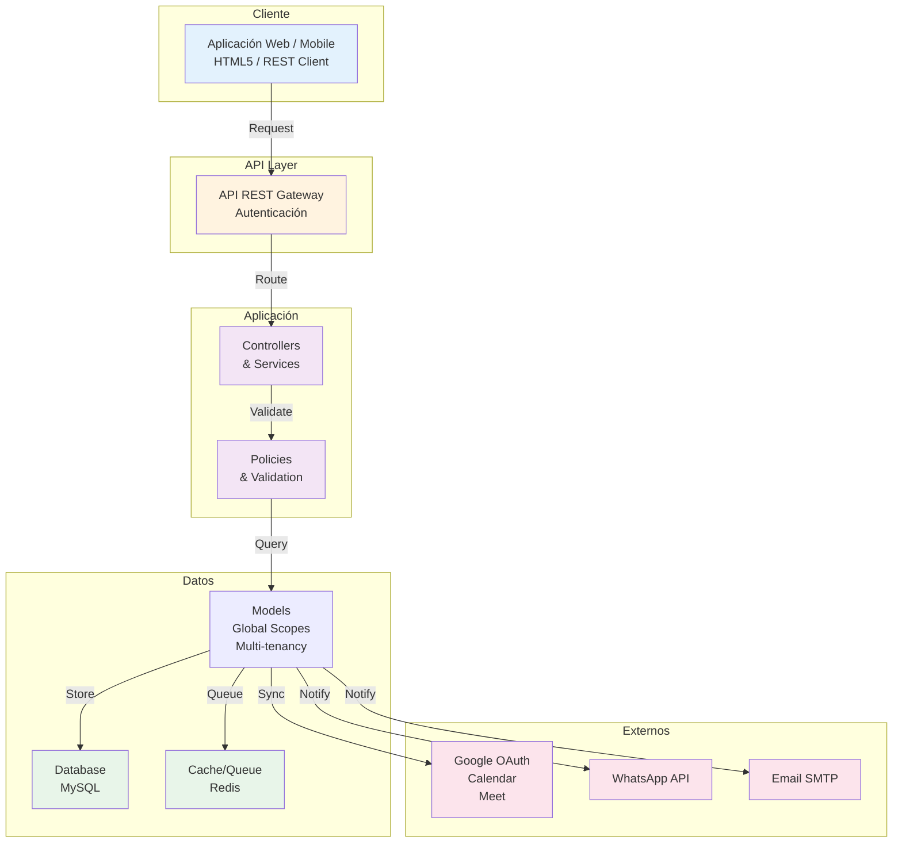
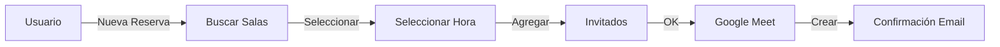
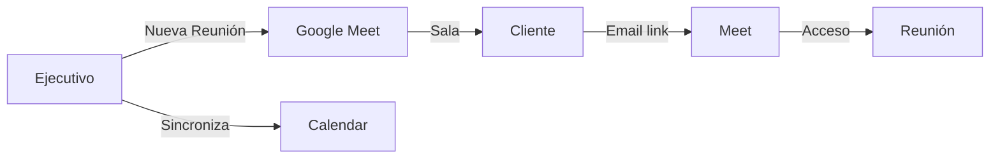
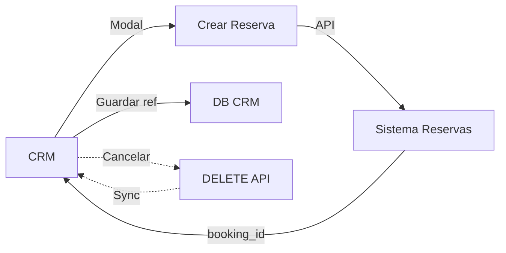

# Sistema de Reservas de Salas

Bienvenido a la documentación completa del **Sistema de Reservas de Salas de Reuniones** con arquitectura multi-tenant, autenticación Google OAuth y funcionalidades avanzadas.

## ¿Qué es este Sistema?

Un sistema completo de gestión de reservas de salas de reuniones que proporciona:

- **Gestión centralizada** de salas y disponibilidad
- **Reservas inteligentes** con detección de conflictos automática
- **Videoconferencias integradas** mediante Google Meet
- **Notificaciones múltiples** (Email, WhatsApp, Calendar)
- **API REST** para integraciones con sistemas externos
- **Multi-tenant** - Múltiples organizaciones en una sola instancia
- **Escalable** - Diseñado para crecer con tu negocio

---

## Guías Principales

### Para Nuevos Usuarios

Comienza aquí si es tu primera vez usando el sistema:

1. **[Características y Funcionalidades](./features.md)**
   - Resumen completo de todas las funciones disponibles
   - Casos de uso comunes
   - Capacidades de integración

### Para Desarrolladores

Si necesitas integrar el sistema con tus aplicaciones:

2. **[Guía de Integración API](./integration-api.md)**

   - Conceptos básicos de la API
   - Autenticación y seguridad
   - Flujos de integración comunes
   - Ejemplos en múltiples lenguajes

3. **[Referencia de Endpoints](./api-reference.md)**

   - Listado completo de endpoints
   - Parámetros y respuestas
   - Códigos de error
   - Ejemplos cURL

4. **[Flujos y Casos de Uso](./workflows.md)**
   - Diagramas visuales de procesos
   - Escenarios de integración
   - Flujos detallados paso a paso

---

## Inicio Rápido

### Para Usuarios - Crear tu Primera Reserva

```
1. Inicia sesión con Google
2. Click en "Nueva Reserva"
3. Selecciona sala y horario
4. Agrega invitados (opcional)
5.  Crear Google Meet (opcional)
6. Enviar
 ¡Reserva creada!
```

**Tiempo:** ~5 minutos

### Para Desarrolladores - Crear tu Primera Integración

```bash
# 1. Obtener autenticación
curl -X POST https://tudominio.com/auth/google

# 2. Obtener lista de salas
curl https://tudominio.com/api/rooms \
  -H "Authorization: Bearer TOKEN"

# 3. Crear reserva
curl -X POST https://tudominio.com/api/bookings \
  -H "Authorization: Bearer TOKEN" \
  -H "Content-Type: application/json" \
  -d '{
    "title": "Mi Reunión",
    "room_id": 1,
    "start_datetime": "2025-01-15T10:00:00Z",
    "end_datetime": "2025-01-15T11:00:00Z"
  }'
```

**Tiempo:** ~10 minutos

---

## Funcionalidades Principales

### Core

- **Autenticación Google OAuth** - Login seguro con cuentas de Google
- **Multi-tenancy** - Múltiples organizaciones aisladas
- **Gestión de Salas** - CRUD completo con capacidades
- **Sistema de Reservas** - Inteligente con validaciones

### Notificaciones

- **Email** - Templates HTML personalizados
- **WhatsApp** - Confirmaciones y recordatorios
- **Teléfono** - Verificación OTP

### Integraciones

- **Google Meet** - Videoconferencias automáticas
- **Google Calendar** - Sincronización de eventos
- **API REST** - Para sistemas externos

### Seguridad

- **Tokens seguros** - OAuth + Sanctum
- **Auditoría completa** - Log de todas las acciones
- **CSRF Protection** - Contra ataques comunes
- **Encriptación** - De datos sensibles

---

## Arquitectura



**Componentes principales:**

- **Cliente**: Interfaz web o móvil
- **API Gateway**: Punto de entrada con autenticación
- **Aplicación**: Lógica de negocio y validaciones
- **Base de datos**: Almacenamiento persistente
- **Cache/Queue**: Procesamiento asíncrono
- **Servicios externos**: Google, WhatsApp, Email

---

## Casos de Uso Típicos

### Equipo Interno

> Agendar reunión con equipo de trabajo



### Cliente Externo

> Agendar llamada de ventas con prospecto



### CRM Integration

> Sincronizar reuniones entre CRM y Sistema



---

## Integraciones Soportadas

| Sistema               | Tipo             | Estado   |
| --------------------- | ---------------- | -------- |
| **Google OAuth**      | Autenticación    | Completo |
| **Google Calendar**   | Sincronización   | Completo |
| **Google Meet**       | Videoconferencia | Completo |
| **WhatsApp Business** | Notificaciones   | Completo |
| **Email SMTP**        | Notificaciones   | Completo |
| **REST API**          | Integraciones    | Completo |
| **CRM (Genérico)**    | Integración      | Ejemplos |
| **Webhooks**          | Eventos          | Próximo  |

---

## Estructura de Documentación

```
docs/
 index.md (este archivo)
 features.md
    Listado completo de funcionalidades
 integration-api.md
    Conceptos básicos
    Flujos de integración
    Ejemplos en JavaScript, Python, PHP
    Manejo de errores
 api-reference.md
    Endpoints de teléfono
    Endpoints de salas
    Endpoints de reservas
    Endpoints de dashboard
    Códigos de respuesta
 workflows.md
    Flujos visuales
    Diagramas de proceso
    Casos de uso
 release-notes/
    Novedades por versión
```

---

## Preguntas Frecuentes

### ¿Cómo creo una cuenta?

Usa "Login con Google" - Se creará automáticamente basado en tu email de dominio autorizado.

### ¿Puedo usar esto sin Google Meet?

Sí, el Google Meet es opcional. Puedes agregar enlaces de Zoom, Teams u otra plataforma en la descripción.

### ¿Cuál es el costo?

Es un servicio SaaS pagado. Contáctanos para información sobre planes y precios adaptados a tu organización.

### ¿Soporta integraciones personalizadas?

Sí, tenemos API REST completa y documentación para integraciones.

### ¿Puedo personalizar el branding?

Sí, el sistema soporta customización por tenant (logos, colores, dominios).

### ¿Qué pasa con mis datos?

Todos los datos son aislados por tenant y almacenados de forma segura en AWS.

---

## Soporte y Recursos

### Centro de Ayuda

- [Documentación Completa](./features.md)
- [Ejemplos de API](./integration-api.md)
- Guía de Solución de Problemas _(próximamente)_

### Profesional

- Email: soporte@aldored.com
- Web: www.aldored.com

---

## Modelo de Negocio

Este es un **servicio SaaS propietario** ofrecido por **AldoRed SpA**.

### Características del Servicio:

- Plataforma hospedada en nuestros servidores
- Mantenimiento y actualizaciones incluidas
- Soporte técnico profesional
- Escalabilidad garantizada
- Seguridad y backups automáticos

### Acceso:

- Solo disponible para clientes autorizados
- No es open-source ni auto-hospedable
- Requiere suscripción activa

---

## Próximos Pasos

Según tu rol, recomendamos:

### Usuarios Finales

1. Leer [Características](./features.md)
2. Ver tutorial de "Crear Reserva"
3. Explorar el sistema

### Desarrolladores

1. Leer [Guía de Integración](./integration-api.md)
2. Revisar [Referencia de API](./api-reference.md)
3. Ejecutar ejemplos de [Workflows](./workflows.md)
4. Implementar tu integración

### Administradores

1. Revisar [Características](./features.md)
2. Configurar tenants y dominios
3. Personalizar salas y horarios
4. Establecer políticas de acceso

---

## Estadísticas

```
Funcionalidades:      23+
Endpoints API:        15+
Plataformas:          Web, Mobile, API
Idiomas soportados:   2+ (ES, EN)
Usuarios simultáneos: Sin límite
Tenants:              Sin límite
Uptime:               99.9%
```

---

<div align="center">

**¿Listo para comenzar?**

[ Ver Características](./features.md) • [ Guía de Integración](./integration-api.md) • [ Solicitar Demo](mailto:soporte@aldored.com)

---

**Servicio SaaS Propietario** © **AldoRed SpA**

Reservado todos los derechos

</div>
