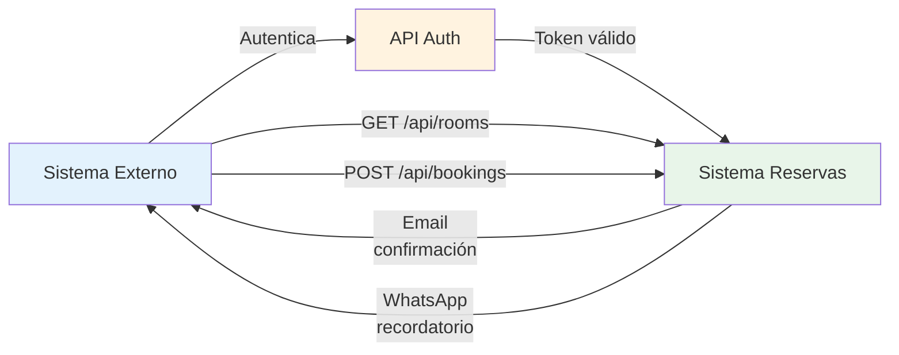
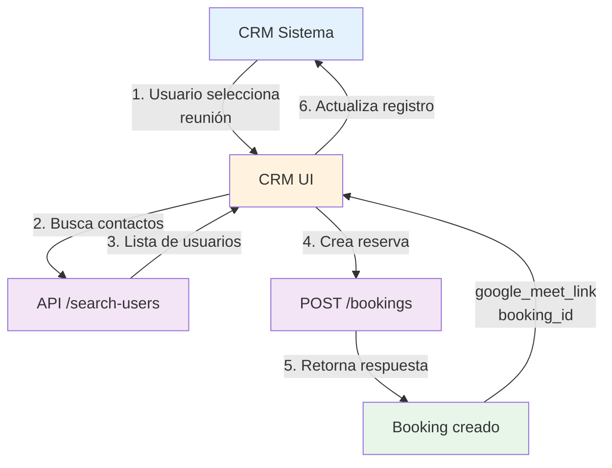
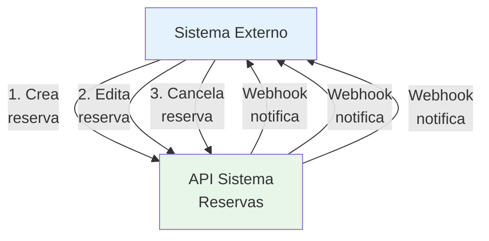

# Guía de Integración API

Esta guía está diseñada para desarrolladores que quieran integrar el sistema de reservas en sus aplicaciones externas.

## Tabla de Contenidos

1. [Autenticación](#autenticación)
2. [Conceptos Básicos](#conceptos-básicos)
3. [Flujos de Integración](#flujos-de-integración)
4. [Ejemplos Prácticos](#ejemplos-prácticos)
5. [Manejo de Errores](#manejo-de-errores)
6. [Rate Limiting](#rate-limiting)

---

## Autenticación

### Headers Requeridos

Todos los endpoints requieren que incluyas los siguientes headers:

```http
Content-Type: application/json
Accept: application/json
Authorization: Bearer YOUR_TOKEN_HERE
```

O si usas autenticación basada en sesión:

```http
Content-Type: application/json
Accept: application/json
Cookie: laravel_session=YOUR_SESSION_COOKIE
```

### Obtener un Token

1. **Login con Google OAuth:**

   ```
   GET https://tudominio.com/auth/google
   ```

2. **Procesa el callback:**

   ```
   GET https://tudominio.com/auth/google/callback?code=AUTHORIZATION_CODE
   ```

3. **El sistema retorna una sesión** que puedes usar en las peticiones API

### Renovación de Token

Los tokens OAuth se renuevan automáticamente. Si trabajas con Sanctum tokens personalizados, éstos son válidos hasta su expiración.

---

## Conceptos Básicos

### Base URL

```
https://tudominio.com/api
```

### Formatos de Respuesta

**Respuesta exitosa (200/201):**

```json
{
  "data": {
    "id": 1,
    "name": "Sala A",
    "status": "active"
  }
}
```

**Respuesta con paginación (200):**

```json
{
  "data": [
    { "id": 1, "name": "Sala A" },
    { "id": 2, "name": "Sala B" }
  ],
  "meta": {
    "current_page": 1,
    "per_page": 15,
    "total": 42,
    "last_page": 3
  }
}
```

**Errores (400/422):**

```json
{
  "message": "Validation failed",
  "errors": {
    "title": ["El título es requerido"],
    "room_id": ["La sala no existe"]
  }
}
```

### Formatos de Fecha

Todas las fechas deben ser en formato **ISO 8601 con timezone**:

```
2025-01-15T10:30:00Z          // UTC
2025-01-15T10:30:00+02:00     // Con offset
```

Para respuestas, el sistema siempre retorna en UTC (Z).

---

## Flujos de Integración

### Flujo 1: Reserva Simple



**Pasos:**

1. **Obtener lista de salas:**

   ```bash
   GET /api/rooms
   ```

2. **Verificar disponibilidad:**

   ```bash
   GET /api/rooms/1/availability?start_datetime=2025-01-15T10:00:00Z&end_datetime=2025-01-15T11:00:00Z
   ```

3. **Crear reserva:**
   ```bash
   POST /api/bookings
   {
     "title": "Reunión",
     "room_id": 1,
     "start_datetime": "2025-01-15T10:00:00Z",
     "end_datetime": "2025-01-15T11:00:00Z"
   }
   ```

### Flujo 2: Integración con CRM



**Pasos:**

1. **Buscar usuarios del sistema:**

   ```bash
   GET /api/bookings/search-users?q=maria
   ```

2. **Crear reserva con invitados:**

   ```bash
   POST /api/bookings
   {
     "title": "Reunión con cliente",
     "room_id": 1,
     "start_datetime": "2025-01-15T14:00:00Z",
     "end_datetime": "2025-01-15T15:00:00Z",
     "guests": ["maria@example.com"],
     "has_google_meet": true
   }
   ```

3. **Extraer Google Meet link:**
   ```json
   {
     "google_meet_link": "https://meet.google.com/abc-defg-hij"
   }
   ```

### Flujo 3: Sincronización Bidireccional



**Nota:** Los webhooks están disponibles como extensión personalizada.

---

## Ejemplos Prácticos

### Ejemplo 1: JavaScript/Fetch

#### Crear una reserva

```javascript
const createBooking = async (
  title,
  roomId,
  startDateTime,
  endDateTime,
  guests = []
) => {
  const response = await fetch("/api/bookings", {
    method: "POST",
    headers: {
      "Content-Type": "application/json",
      Accept: "application/json",
      Authorization: "Bearer YOUR_TOKEN",
    },
    body: JSON.stringify({
      title,
      room_id: roomId,
      start_datetime: startDateTime,
      end_datetime: endDateTime,
      has_google_meet: true,
      guests,
    }),
  });

  if (!response.ok) {
    const error = await response.json();
    throw new Error(error.message);
  }

  return response.json();
};

// Uso
try {
  const booking = await createBooking(
    "Reunión de Equipo",
    1,
    "2025-01-15T10:00:00Z",
    "2025-01-15T11:00:00Z",
    ["maria@example.com"]
  );

  console.log("Reserva creada:", booking.data);
  console.log("Google Meet:", booking.data.google_meet_link);
} catch (error) {
  console.error("Error:", error.message);
}
```

#### Listar reservas con filtros

```javascript
const listBookings = async (
  roomId = null,
  startDate = null,
  endDate = null
) => {
  const params = new URLSearchParams();
  if (roomId) params.append("room_id", roomId);
  if (startDate) params.append("start_date", startDate);
  if (endDate) params.append("end_date", endDate);

  const response = await fetch(`/api/bookings?${params}`, {
    headers: {
      Authorization: "Bearer YOUR_TOKEN",
    },
  });

  return response.json();
};

// Uso
const bookings = await listBookings(1, "2025-01-15", "2025-01-31");
console.log("Total reservas:", bookings.meta.total);
```

### Ejemplo 2: Python/Requests

#### Crear reserva y obtener Google Meet

```python
import requests
from datetime import datetime, timedelta

BASE_URL = 'https://tudominio.com/api'
TOKEN = 'YOUR_TOKEN'

headers = {
    'Authorization': f'Bearer {TOKEN}',
    'Content-Type': 'application/json'
}

def create_booking_with_meet(title, room_id, start_time, duration_minutes):
    end_time = start_time + timedelta(minutes=duration_minutes)

    payload = {
        'title': title,
        'room_id': room_id,
        'start_datetime': start_time.isoformat() + 'Z',
        'end_datetime': end_time.isoformat() + 'Z',
        'has_google_meet': True
    }

    response = requests.post(
        f'{BASE_URL}/bookings',
        json=payload,
        headers=headers
    )

    if response.status_code in [200, 201]:
        data = response.json()
        return {
            'booking_id': data['data']['id'],
            'google_meet_link': data['data'].get('google_meet_link'),
            'status': data['data']['status']
        }
    else:
        raise Exception(f'Error: {response.json()}')

# Uso
now = datetime.utcnow()
booking = create_booking_with_meet(
    title='Reunión Python',
    room_id=1,
    start_time=now,
    duration_minutes=30
)

print(f'Reserva: {booking["booking_id"]}')
print(f'Google Meet: {booking["google_meet_link"]}')
```

#### Verificar disponibilidad de sala

```python
def check_availability(room_id, start_datetime, end_datetime):
    response = requests.get(
        f'{BASE_URL}/rooms/{room_id}/availability',
        params={
            'start_datetime': start_datetime.isoformat() + 'Z',
            'end_datetime': end_datetime.isoformat() + 'Z'
        },
        headers=headers
    )

    return response.json()

# Uso
availability = check_availability(1, now, now + timedelta(hours=1))
if availability['available']:
    print(' Sala disponible')
else:
    print(' Sala ocupada')
```

### Ejemplo 3: PHP/cURL

#### Crear reserva desde PHP

```php
<?php

$token = 'YOUR_TOKEN';
$baseUrl = 'https://tudominio.com/api';

function createBooking($title, $roomId, $startDateTime, $endDateTime, $guests = []) {
    global $token, $baseUrl;

    $payload = [
        'title' => $title,
        'room_id' => $roomId,
        'start_datetime' => $startDateTime,
        'end_datetime' => $endDateTime,
        'has_google_meet' => true,
        'guests' => $guests
    ];

    $ch = curl_init($baseUrl . '/bookings');
    curl_setopt_array($ch, [
        CURLOPT_RETURNTRANSFER => true,
        CURLOPT_HTTPHEADER => [
            'Authorization: Bearer ' . $token,
            'Content-Type: application/json'
        ],
        CURLOPT_POST => true,
        CURLOPT_POSTFIELDS => json_encode($payload)
    ]);

    $response = curl_exec($ch);
    $httpCode = curl_getinfo($ch, CURLINFO_HTTP_CODE);
    curl_close($ch);

    if (in_array($httpCode, [200, 201])) {
        return json_decode($response, true);
    } else {
        throw new Exception("Error: " . $response);
    }
}

// Uso
try {
    $booking = createBooking(
        'Reunión Importante',
        1,
        '2025-01-15T15:00:00Z',
        '2025-01-15T16:00:00Z',
        ['maria@example.com']
    );

    echo "Reserva creada: " . $booking['data']['id'] . "\n";
    echo "Google Meet: " . $booking['data']['google_meet_link'] . "\n";
} catch (Exception $e) {
    echo "Error: " . $e->getMessage();
}
?>
```

---

## Manejo de Errores

### Códigos de Estado HTTP

| Código | Significado          | Acción                  |
| ------ | -------------------- | ----------------------- |
| 200    | OK                   | Operación exitosa       |
| 201    | Created              | Recurso creado          |
| 204    | No Content           | Eliminado sin contenido |
| 400    | Bad Request          | Validación fallida      |
| 401    | Unauthorized         | Token ausente/inválido  |
| 403    | Forbidden            | Sin permisos            |
| 404    | Not Found            | Recurso no existe       |
| 422    | Unprocessable Entity | Error de validación     |
| 429    | Too Many Requests    | Rate limit excedido     |
| 500    | Server Error         | Error del servidor      |

### Errores de Validación

```json
{
  "message": "Validation failed",
  "errors": {
    "title": ["El título es requerido"],
    "room_id": ["La sala no existe"],
    "start_datetime": ["La hora debe ser después de ahora"]
  }
}
```

**Manejo en JavaScript:**

```javascript
try {
  const response = await fetch("/api/bookings", {
    method: "POST",
    headers: {
      "Content-Type": "application/json",
      Authorization: "Bearer TOKEN",
    },
    body: JSON.stringify(data),
  });

  if (!response.ok) {
    const error = await response.json();

    if (response.status === 422) {
      // Errores de validación
      console.error("Errores:", error.errors);
    } else if (response.status === 401) {
      // Token expirado o inválido
      console.error("Autenticación fallida");
    } else {
      console.error("Error:", error.message);
    }
  }
} catch (error) {
  console.error("Network error:", error);
}
```

---

## Rate Limiting

### Límites Aplicados

| Endpoint                        | Límite | Ventana  |
| ------------------------------- | ------ | -------- |
| POST `/api/me/phone`            | 6      | 1 minuto |
| POST `/api/me/phone/verify-otp` | 6      | 1 minuto |
| Otros endpoints                 | 60     | 1 minuto |

### Respuesta cuando se excede el límite

```json
{
  "message": "Too many requests. Please try again in 60 seconds.",
  "retry_after": 60
}
```

**Status:** 429 Too Many Requests

**Headers adicionales:**

```
Retry-After: 60
X-RateLimit-Limit: 60
X-RateLimit-Remaining: 0
X-RateLimit-Reset: 1642156800
```

### Implementar backoff exponencial

```javascript
async function makeRequestWithRetry(url, options, maxRetries = 3) {
  for (let attempt = 1; attempt <= maxRetries; attempt++) {
    const response = await fetch(url, options);

    if (response.status === 429) {
      const retryAfter = parseInt(response.headers.get("Retry-After") || "60");
      console.log(
        `Rate limited. Retrying in ${retryAfter}s (attempt ${attempt}/${maxRetries})`
      );

      await new Promise((resolve) => setTimeout(resolve, retryAfter * 1000));
      continue;
    }

    return response;
  }

  throw new Error("Max retries exceeded");
}
```

---

## Webhook Events (Extensión)

:::info
Los webhooks están disponibles en versiones premium o pueden implementarse como extensión.
:::

### Eventos Disponibles

```
booking.created       // Nueva reserva
booking.updated       // Reserva actualizada
booking.cancelled     // Reserva cancelada
booking.deleted       // Reserva eliminada
user.phone_verified   // Teléfono verificado
```

### Ejemplo de payload

```json
{
  "event": "booking.created",
  "timestamp": "2025-01-15T10:30:00Z",
  "data": {
    "id": 1,
    "title": "Reunión",
    "status": "confirmed",
    "room": { "id": 1, "name": "Sala A" },
    "start_datetime": "2025-01-15T11:00:00Z",
    "google_meet_link": "https://meet.google.com/xxx"
  }
}
```

---

## Mejores Prácticas

### 1. Manejo de Errores

- Siempre verifica el status code
- Maneja timeout de red
- Implementa reintentos con backoff

### 2. Performance

- Cachea resultados de GET cuando sea posible
- Usa filtros en lugar de descargar todo
- Agrupa operaciones cuando puedas

### 3. Seguridad

- Nunca expongas tokens en el cliente
- Guarda tokens en variables de entorno
- Usa HTTPS siempre
- Valida datos antes de enviar

### 4. Desarrollo

- Usa variables de entorno para URLs
- Implementa logging de requests
- Prueba con todos los status codes
- Versionado de API (para futuro)

### 5. Integración

- Documenta qué datos necesitas de cada endpoint
- Prueba con datos reales
- Implementa sincronización incremental
- Usa webhooks para actualizaciones en tiempo real

---
