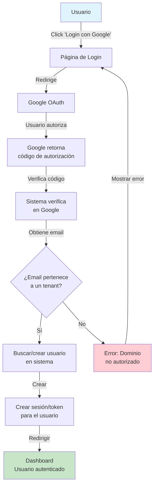
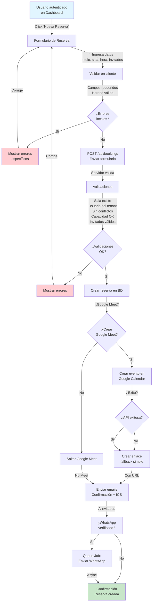
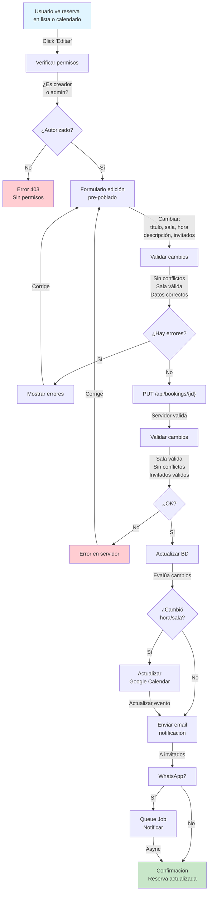
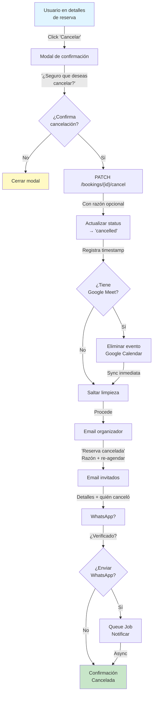
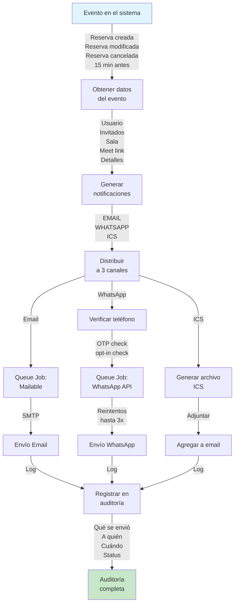
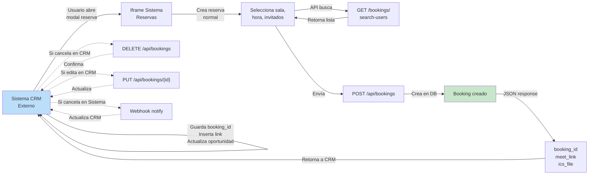
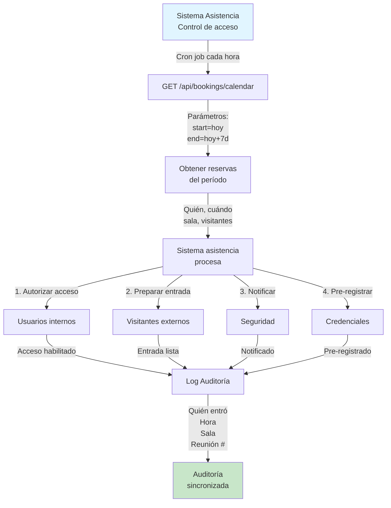

# Flujos y Casos de Uso

Documentación visual de los principales flujos de operación del sistema y ejemplos de cómo integrarlo con otros sistemas.

## Índice de Flujos

1. [Autenticación](#autenticación)
2. [Creación de Reserva](#creación-de-reserva)
3. [Edición de Reserva](#edición-de-reserva)
4. [Cancelación de Reserva](#cancelación-de-reserva)
5. [Notificaciones](#notificaciones)
6. [Integraciones Externas](#integraciones-externas)

---

## Autenticación

### Flujo de Login con Google OAuth



**Pasos:**

1. Usuario hace clic en "Login con Google"
2. Se redirige a Google OAuth
3. Usuario autoriza la aplicación
4. Sistema verifica el código y obtiene email
5. Sistema busca o crea usuario basado en el tenant
6. Se crea sesión/token
7. Usuario entra al dashboard

---

## Creación de Reserva

### Flujo Principal - Crear Nueva Reserva



**Acciones Automáticas:**

- Email de confirmación con archivo ICS
- WhatsApp con detalles de reunión
- Evento en Google Calendar (si aplica)
- Google Meet enlazado en el evento

---

## Edición de Reserva

### Flujo de Actualización de Reserva



**Notificaciones:**

- Email a todos los invitados con cambios
- WhatsApp al organizador
- Evento de Google Calendar sincronizado

---

## Cancelación de Reserva

### Flujo de Cancelación y Limpieza



**Limpieza Automática:**

- Eliminar evento de Google Calendar
- Notificar a todos los invitados
- Notificar al organizador por WhatsApp
- Registrar cancelación en auditoría

---

## Notificaciones

### Flujo de Sistema de Notificaciones



**Tipos de Notificaciones:**

1. **Confirmación de Reserva**

   - Destinatario: Organizador + Invitados
   - Contenido: Detalles de reunión, Google Meet link, ICS

2. **Edición de Reserva**

   - Destinatario: Todos los involucrados
   - Contenido: Cambios realizados, nuevos detalles

3. **Cancelación**

   - Destinatario: Organizador + Invitados
   - Contenido: Motivo de cancelación, datos de lo cancelado

4. **Recordatorio (15 min antes)**
   - Destinatario: Organizador + Invitados con WhatsApp
   - Contenido: Recordatorio de próxima reunión, Google Meet link

---

## Integraciones Externas

### Flujo de Integración CRM + Sistema de Reservas



### Flujo de Integración con Sistema de Asistencia



---

## Casos de Uso Típicos

### Caso 1: Reunión Simple Entre Internos

**Actor:** Usuario de la empresa  
**Objetivo:** Agendar reunión con equipo

**Pasos:**

1. Login con Google
2. Click "Nueva Reserva"
3. Seleccionar sala
4. Seleccionar hora
5. Buscar y agregar invitados (María, Juan)
6. Crear Google Meet
7. Crear reserva

**Resultado:**

- Confirmación a todos por email
- Recordatorio 15 min antes por WhatsApp

**Duración:** ~5 minutos  
**Notificaciones:** 2 emails + 1 WhatsApp

---

### Caso 2: Reunión con Cliente Externo

**Actor:** Ejecutivo de ventas  
**Objetivo:** Agendar llamada con prospecto

**Pasos:**

1. Login con Google
2. Click "Nueva Reserva"
3. Seleccionar sala (con Google Meet)
4. Seleccionar hora
5. Agregar email de cliente (externo)
6. Crear Google Meet
7. Crear reserva

**Resultado:**

- Email al cliente con Meet link
- Email a ejecutivo con confirmación
- Recordatorio 15 min antes
- Cliente accede al Meet desde email

**Duración:** ~5 minutos  
**Notificaciones:** 3 emails + 1 WhatsApp

---

### Caso 3: Integración con CRM

**Actor:** Sistema CRM externo  
**Objetivo:** Sincronizar reuniones en ambos sistemas

**Flujo:**

```
CRM → Abre modal "Agendar Reunión"
    → API GET /bookings/search-users?q=maria
    → API POST /bookings (crear)
    → API GET /bookings/{id} (obtener detalles)
    → Guarda booking_id en CRM
    → Usuario ve Google Meet link en CRM

Usuario cancela en CRM:
    → API DELETE /bookings/{id}
    → Sistema notifica por email

Usuario edita en Sistema:
    → Webhook notifica a CRM
    → CRM actualiza su base de datos
```

---

### Caso 4: Reserva Recurrente (Semanal)

**Nota:** Función puede requerir extensión

**Pasos:**

1. Usuario crea reserva
2. Sistema expone opción "Recurrente"
3. Selecciona "Semanal" y duración
4. Sistema crea múltiples reservas

**Resultado:**

- Una reserva por cada semana
- Cada una es independiente
- Se pueden editar/cancelar individualmente

---

## Próximas Mejoras

Planeado para futuras versiones:

- Reservas recurrentes
- Webhooks para integraciones avanzadas
- Importar/exportar de calendarios
- Recordatorios personalizables
- Reportes y analytics
- RSVP y confirmación de asistencia
- Salas virtuales integradas

---
