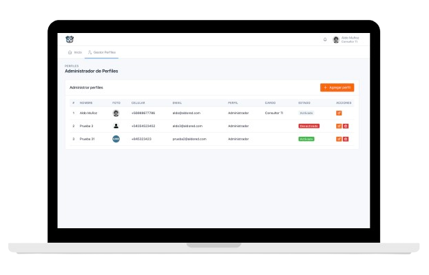
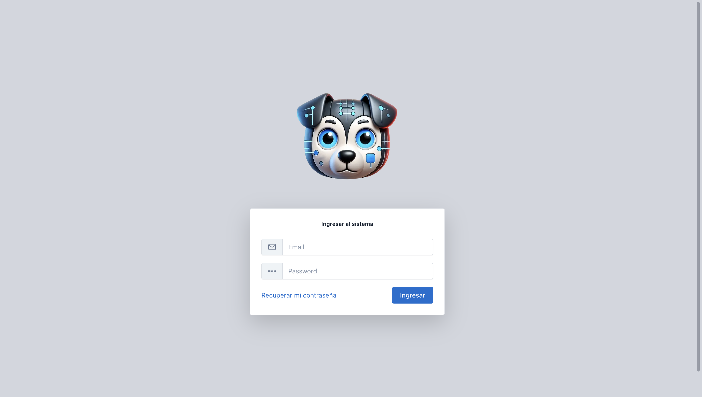
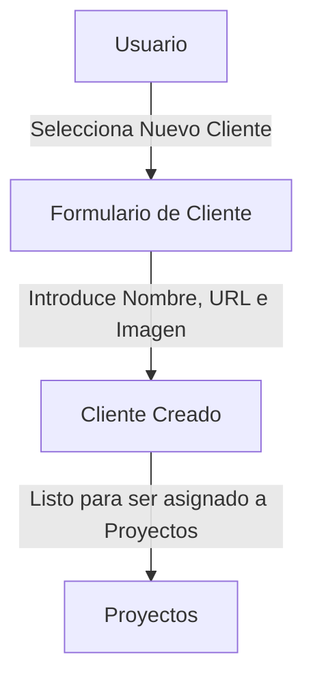

### Propósito:

Ponga en funcionamiento su nuevo ERP en minutos.

### 1. 👋🏻 Introducción

Sistema ERP personalizable que integra autenticación, gestión de usuarios y módulos a medida para optimizar procesos empresariales y mejorar la toma de decisiones

    

### 2. 🔧 Prerequisitos

Para seguir este tutorial necesitas:

- **Navegador web moderno**: AldoERP funciona en cualquier navegador (Chrome, Firefox, Edge, Safari), ya sea desde un dispositivo móvil o un computador.

  > 💡 Recomendamos usar un computador para aprovechar al máximo la experiencia.

- **Cuenta de administrador activa**: recibirás los datos de acceso por correo electrónico una vez que tu servicio de AldoERP esté activado.

> **Nota:** No se requieren instalaciones adicionales, ya que AldoERP es un sistema 100 % en línea. ¡Solo abre tu navegador y comienza!

### 3. Primer inicio de sesión y Tour

Sigue estos pasos para acceder por primera vez y familiarizarte con AldoERP:

1. **Accede a la pantalla de login**
   - Abre tu navegador e ingresa a `https://app.tucompañia.com`.
   - Verás un formulario con los campos **Correo electrónico** y **Contraseña**.

    

2. **Ingresa tus credenciales**

   - Escribe tu correo y la contraseña que recibiste por correo.
   - Haz clic en **Ingresar**.

     :::info TIP
     Si olvidaste tu contraseña, haz clic en “¿Olvidaste tu contraseña?” para recibir un enlace de recuperación.
     :::

3. **Explora el Dashboard**  
   Al entrar, verás el **Dashboard** te encontrarás con:

   - **Notificaciones**
   - **Proyectos**
   - **Clientes**

4. **Tour rápido**  
   Utiliza el tour integrado para conocer las secciones principales:

   1. **Paso 1**

      - Haz clic en el icono de ayuda (❔) en la esquina superior derecha.

   2. **Paso 2**

      - Sigue las indicaciones flotantes para descubrir:
        - Menú superior
        - Gestión del sistema
        - Gestión de perfiles
        - Configuración del perfil
        - ...

   3. **Paso 3**

      - Finaliza el tour para ocultar las guías y empezar a trabajar.

      :::info TIP
      Puedes reiniciar el tour en cualquier momento desde **Perfil → Ayuda → Iniciar Tour**.
      :::

### 4. ⚙️ Crea tu primer Cliente

Antes de empezar a gestionar proyectos, lo primero es definir tu Cliente:

Accede al módulo de Clientes:

1. En el menú lateral, haz clic en "Clientes".
2. Pulsa el botón ➕ Nuevo Cliente.

#### Rellena los datos básicos

Campos requeridos:

- **Nombre**: Nombre de la empresa o cliente (por ejemplo, "ACME Corp")
- **URL**: Página web oficial del cliente (p. ej. https://www.acme.com)
- **Imagen**: Logo o imagen representativa (formatos JPG, PNG)

#### Guarda y vincula

1. Haz clic en "Guardar" para crear el registro del cliente
2. Para asociar el cliente con proyectos:
   - Ve al módulo Proyectos
   - Al editar o crear un proyecto
   - Selecciona el cliente del menú desplegable "Cliente"

:::success TIP
Usa imágenes claras y URLs correctas: así tu equipo identificará rápido cada cliente en la lista.
:::

:::info Nota:
Más adelante podrás invitar usuarios específicos para cada cliente y asignarles roles y permisos desde Usuario Administrador → Gestor de perfiles.
:::

### 5. Crea tu primer Proyecto
